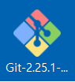
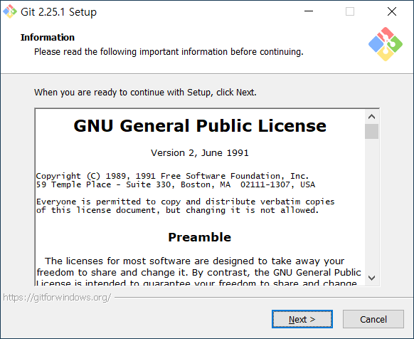
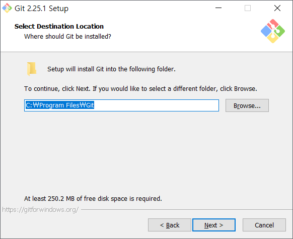
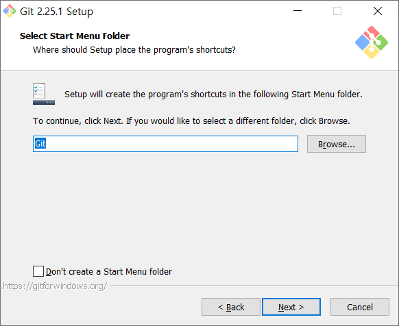
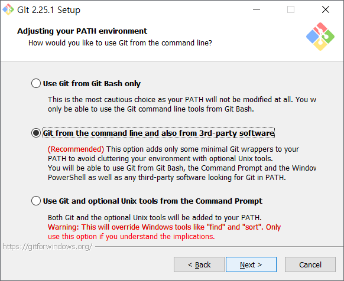
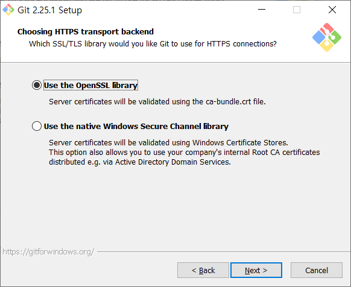
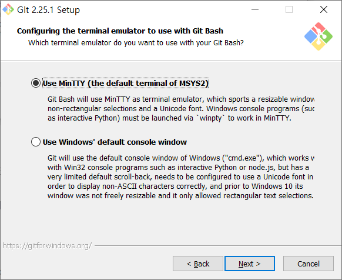
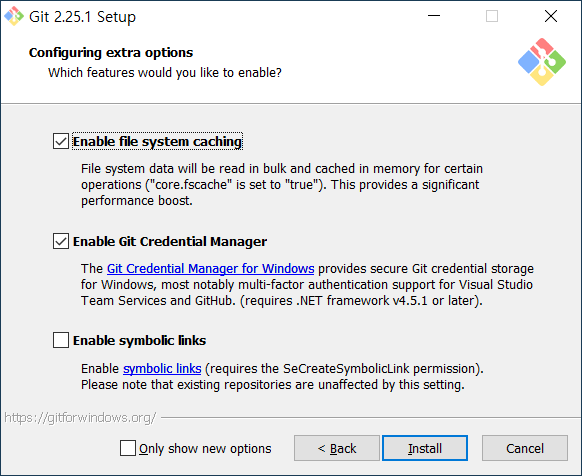

# Git
## Git이란
 깃(Git)은 컴퓨터 파일의 변경사항을 추적하고 여러 명의 사용자들 간에 해당 파일들의 작업을 조율하기 위한 **분산 버전 관리 시스템**(버전관리=형상관리) 이다.
 
소프트웨어 개발에서 **소스 코드 관리**에 주로 사용되지만 어떠한 집합의 **파일의 변경사항을 지속적으로 추적**하기 위해 사용될 수 있다.

깃은 2005년에 리눅스 커널 개발을 위해 초기 개발에 기여한 다른 커널 개발자들과 함께 2005년에 리누스 토르발스가 처음 개발한 것이다.

깃은 GNU 일반 공중 사용 허가서 v2 하에 배포되는 자유 소프트웨어이다.

출처 : [나무위키](https://ko.wikipedia.org/wiki/%EA%B9%83_(%EC%86%8C%ED%94%84%ED%8A%B8%EC%9B%A8%EC%96%B4))

## Git설치
1. [Git 홈페이지](https://git-scm.com/)
   - 

2. 설치파일 실행(버전이 상이 할 수있으니 최신으로 받아서 설치하면됨)
   - 

3. 설치화면 
   - 
    > `Next`클릭

4. 설치 경로 지정
   - 
    > 원하는 설치 위치가 있으면 지정 후 `Next`클릭

5. 설치할 구성요소 선택
   - 
   - 설치 구성요소 설명
    > - `Additional icons` > `On the Desktop` : 바탕화면 아이콘 생성
    > - `Windows Explorer interation` > `Git Bash Here` , `Git GUI Here` **(선택)**
    >   - 폴더에서 바로 깃으로 연결할 수 있는 메뉴 추가(마우스 오른쪽버튼시 나오는 메뉴에 깃이 추가됨)
    > - `Git LFS(LargeFile Support)` **(선택)** : 용량이 큰 파일 지원
    > - `Associate .git* configuration files with the default text editor` **(선택)**
    >   - git 구성파일을 기본 텍스트 편집기와 연결 / 
    > - `Associate .sh files to be run with Bash` **(선택)** : 확장자 `.sh`파일을 Git bash와 연결
    > - `Use a TrueType font in all console windows` : 트루타입 글꼴을 윈도우 콘솔창에 적용
    > - `Check daily for Git for Windows updates` : 깃 업데이트를 매일 확인할지 여부

6. 시작메뉴 추가 여부
   - 
   - `Don`t create a Start Menu folder` 체크시 생성하지 않음

7. 깃을 사용할 기본에디터 설정
   - 
   - 깃을 직접 편집할 일이 없으므로 아무거나 선택하고 원하는 에디터가 있다면 선택 후 다음으로 넘어가자

8. 환경변수 옵션 선택
   - 
   - 옵션 설명
    > - `Use git from Git Bash only` : Git Bash에서만 사용
    > - `Git from the command line and also from 3rd-party software`
    >   - 윈도우 환경변수를 등록하여 윈도우 커멘드 라인 등에서 사용 **(선택)**
    > - `Use Git and optional Unix tools from the Windows Command Prompt`
    >   - 윈도우 cmd에서 Git과 유닉스도구를 사용할 경우 환경변수에 추가

9. https 전송시 인증서 선택
   - 
   - 옵션 설명
    > - `Use the OpenSSL library` : OpenSSL 라이브러리 사용 **(선택)**
    > - `Use the native Windows Secure Channel library` : Windows 인증서 저장소를 사용하여 유효성 검사

10. Git 저장소에 체크인, 체크 아웃 할 때 줄 바꿈 옵션 선택
   - 
   - 옵션 설명
   > - `Checkout Windows-style, commit Unix-style line endings` **(선택)**
   >    - 체크아웃시에는 윈도우 스타일, 커밋시에는 유닉스 스타일 적용
   > - `Checkout as-is, commit Unix-style line endings`
   >    - 체크아웃시에는 스타일 변환 없다. 커밋시에만 유닉스 스타일 적용
   > - `Checkout as-is, commit as-is`
   >    - 둘다 스타일 변화 없음
   
   > 개발 하다보면 줄바꿈 때문에 간혹 문제를 겪곤 한다. 
   > 다음 내용을 한번정도는 확인하고 넘어가면 좋을 것 같다.
   > > 프로그래밍 하면서 `\n` 또는 `\r\n`을 사용하여 줄바꿈 처리를 해본적이 있을 것이다. 
   > > 여기서 `\r`을 캐리지 리턴(`Carriage Return`), `\n`을 라인 피드(`Line Feed`) 라고 한다.
   > >
   > > - 윈도우 계열 : `\r\n` 사용
   > > - 유닉스 계열(리눅스, 맥 등) : `\n` 사용

11. `Git Bash` 터미널 에뮬레이터의 설정
    - 
    - 옵션 설명
    > - `Use MinTTY(the default terminal of MSYS2)` **(선택)**
    >   - MinTTY terminal emulator 사용(Git bash 기본 터미널 사용)
    > - `Use Windows' default console window`
    >   - 윈도우 기본 콘솔 사용

12. 기타 옵션
    - 
    - 옵션 설명
    > - `Enable file system caching` **(체크)**
    >   - 빠른 실행을 위해 파일 시스템 데이터를 메모리에 캐시
    > - `Enable Git Credential Manager` **(체크)**
    >   - Windows용 Git 보안 자격증명 저장소를 사용하기 위하여, Git 인증관리자 활성화
    > - `Enable symbolic links`
    >   - symbolic links 활성화
