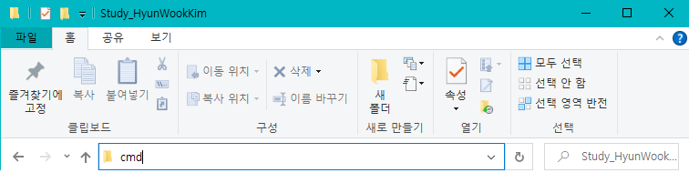
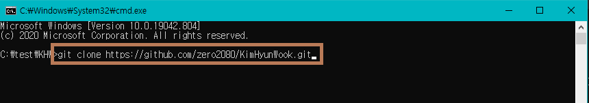
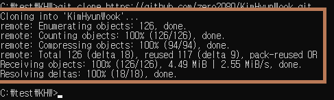
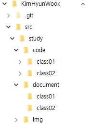

# Git 간단 사용법
## 저장소
깃의 저장소는 레파지토리(`repository`)와 브랜치(`branch`)로 나뉜다.
쉽게 생각해서 레파지토리는 **본사**이고, 브랜치는 **가맹점**으로 보면 된다.
각 본사의 기준을 따르되 가맹점에서 소소한 변화와 그 지역 영업점에 따라 운영 방침을 달리하기때문이다.

1. Repository 동기화
> 우리는 공부를 진행하며 하나의 저장소를 생성하고 이 저장소를 사용할 것이다. 
> 지금 사용중인 저장소는 github라는 서비스에서 제공하는 저장공간을 사용할 것이며, 이를 이용해 우리가 공부하는 노트와 예제 파일을 관리할 것이다. 
> 이제 레파지토리(`repository`)를 동기화 해보자
>
> 1. 파일 관리 디렉토리 생성 후 주소창에 `cmd`엔터 
> 
> 2. `cmd`창에 명령어 입력
>   - `git clone https://github.com/zero2080/KimHyunWook.git`
>   - 
> 
> 3. 레파지토리의 소스코드를 복제한다.
>   - 
>
> 4. 소스코드 생성확인
>   - 
>
> 5. 디렉토리 구성
>   - 
>   - `code`폴더 : 예제 코드가 클래스 단위로 나눠져 있다. 
>       - 복제한 레파지토리는 하나의 자바 프로젝트이므로 이클립트등 코딩편집툴에 추가해서 관리할 수 있다.
>   - `document` : 교제 파일이 들어있다. 각 파일은 `.md`파일로 작성됐으며, github에서가 아닌 파일로 확인하고 싶다면 `typora`등 마크다운 편집기를 이용하면된다.