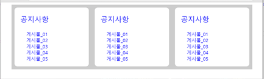
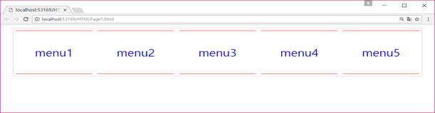
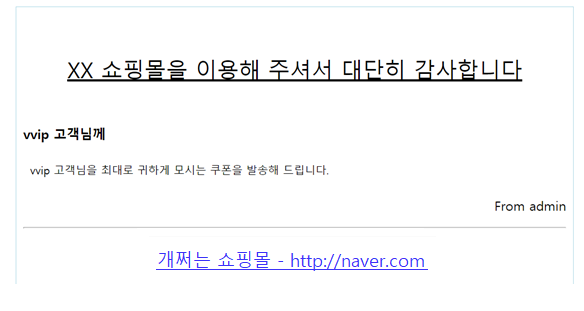
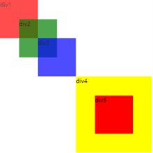
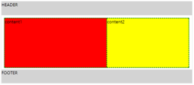
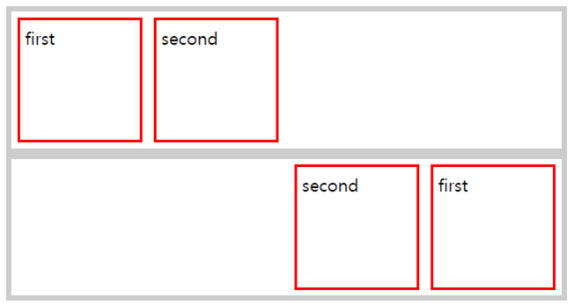
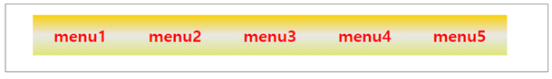
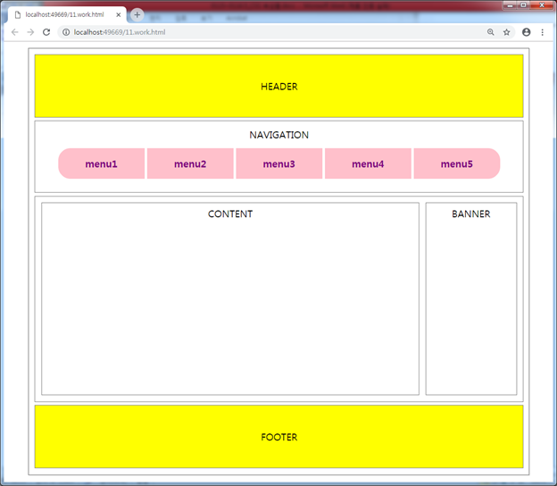

# CSS 속성들

> 1.	CSS3 단위들: em, %, px
> 2.	url() : 백그라운드 이미지
> 3.	background-image
> 4.	display : inline, block, inline-block, none
> 5.	visibility
> 6.	opacity
> 7.	margin과 padding
> 8.	boxing-sizing ; border를 box안으로
> 9.	border
> 10.	글자관련 속성; font-family, font-size, font-weight, font-style, line-height, text-align, text-decoration
> 11.	position
> 12.	float
> 13.	gradient14.	웹폰트

1. `CSS3` 단위
> `CSS3`에서 자주 사용되는 단위들에 대해서 살펴봅니다 (http://pxtoem.com/)
```html
<!DOCTYPE html>
<html lang="ko" xmlns="http://www.w3.org/1999/xhtml">
<head>
  <meta charset="utf-8" />
  <title></title>
  <style>
    #wrap #content1 p:nth-child(2n){background-color:#eeeeee;}
    #wrap #content2 p:nth-child(2n){background-color:#eeeeee;}
    #wrap {width:600px; margin:0 auto; padding:20px; border:1px solid gray; color:#333333; font-weight:bold;}
    #content1 p:nth-child(1){font-size: 1em;}
    #content1 p:nth-child(2){font-size:16px;}
    #content1 p:nth-child(3){font-size:100%;}
    #content1 p:nth-child(4){font-size:1.0em;}
    #content1 p span {display:block; color:deepskyblue; font-size:0.5em;}
    #content2 p:nth-child(1){font-size: 0.7em;}
    #content2 p:nth-child(2){font-size:1.0em;}
    #content2 p:nth-child(3){font-size:125%;}
    #content2 p:nth-child(4){font-size:32px;}
    #content2 p span {display:block; color:deepskyblue;font-size:0.5em;}
  </style>
</head>
<body>
  <div id="wrap">
    <div id="content1">
      <p>
        이들은 산속으로 피해 무장대의 기본성원이 되어 양반지주나 관청을 습격했는데, 지배층들은 이들을 「도적」이라 했다.
        <span>2019년 1월</span>
      </p>
      <p>
        홍길동은 양반관리의 복장을 하고 스스로 「첨지」라 하면서 무장한 많은 농민을 지휘해 여러 고을의 관청들을 습격했다. 결국 체포되어 의금부에서 취조당한 기록이 남아 있다. 뒤에 그에 대한 이야기는 &lt;홍길동&gt; 으로 소설화되기도 한다
        <span>2019년 1월</span>
      </p>
      <p>
        이들은 산속으로 피해 무장대의 기본성원이 되어 양반지주나 관청을 습격했는데, 지배층들은 이들을 「도적」이라 했다.
        <span>2019년 1월</span>
      </p>
      <p>
        홍길동은 양반관리의 복장을 하고 스스로 「첨지」라 하면서 무장한 많은 농민을 지휘해 여러 고을의 관청들을 습격했다. 결국 체포되어 의금부에서 취조당한 기록이 남아 있다. 뒤에 그에 대한 이야기는 &lt;홍길동&gt; 으로 소설화되기도 한다
        <span>2019년 1월</span>
      </p>
    </div>
    <div id="content2">
      <p>
        이들은 산속으로 피해 무장대의 기본성원이 되어 양반지주나 관청을 습격했는데, 지배층들은 이들을 「도적」이라 했다.
        <span>2019년 1월</span>
      </p>
      <p>
        홍길동은 양반관리의 복장을 하고 스스로 「첨지」라 하면서 무장한 많은 농민을 지휘해 여러 고을의 관청들을 습격했다. 결국 체포되어 의금부에서 취조당한 기록이 남아 있다. 뒤에 그에 대한 이야기는 &lt;홍길동&gt; 으로 소설화되기도 한다
        <span>2019년 1월</span>
      </p>
      <p>
        이들은 산속으로 피해 무장대의 기본성원이 되어 양반지주나 관청을 습격했는데, 지배층들은 이들을 「도적」이라 했다.
        <span>2019년 1월</span>
      </p>
      <p>
        홍길동은 양반관리의 복장을 하고 스스로 「첨지」라 하면서 무장한 많은 농민을 지휘해 여러 고을의 관청들을 습격했다. 결국 체포되어 의금부에서 취조당한 기록이 남아 있다. 뒤에 그에 대한 이야기는 &lt;홍길동&gt; 으로 소설화되기도 한다
        <span>2019년 1월</span>
      </p>
    </div>
  </div>
</body>
</html>
```

2. `url()` 
> `background-img` 속성의 속성값으로 많이 사용됩니다. 이 경우 배경이미지의 경로를 나타냅니다
```html
<!DOCTYPE html>
<html lang="ko" xmlns="http://www.w3.org/1999/xhtml">
<head>
    <meta charset="utf-8" />
    <title></title>
    <style>
        #wrap{
            width: 600px;
            height:300px;
            margin:0 auto;
            border: 1px solid #cccccc;
        }
        #content{
            width: 80%;
            height: 100%;
            margin: 0 auto;
            background-image:url('address.jpg');  /*원격지 url도 가능*/
            font-size:2em;
            color: #0026ff;
            font-weight:bold;
            text-align: center;
            background-repeat: no-repeat;
        }
    </style>
</head>
<body>
    <div id="wrap">
        <div id="content">백그라운드 이미지</div>
    </div>
</body>
</html>
```
3. `background-image` 속성
   > 배경을 지정하는 속성

```html
<!DOCTYPE html>
<html lang="ko" xmlns="http://www.w3.org/1999/xhtml">
<head>
    <meta charset="utf-8" />
    <title></title>
	<style>
		div{width:80%; margin:0 auto; height:400px;border:1px solid red; 
			border:1px solid red;background-image:url('address.jpg');}
		div:nth-child(1){ background-position: left top; } /* 배경 이미지를 어디에 위치시킬 것인지 조정*/
		div:nth-child(3){ background-position:right top; } /*left(왼쪽정렬x축) right(오른쪽정렬x축)*/
		div:nth-child(5) { background-position:left center; }/* top(위쪽정렬y축) bottom(아래쪽정렬y축)*/
		div:nth-child(7){ background-position:center; }
		div:nth-child(9){ background-position:50%; }
		div:nth-child(11){background-size:50%; /* 길이가반이니 면적은 1/4 */
			background-repeat:repeat-x; /* x축만 반복 . no-repeat는 반복 안 됨*/
		}
	</style>
</head>
<body>
	<div><h1>이미지</h1></div>
	<br />
	<div><h1>뉴스</h1></div>
	<br />
	<div><h1>이미지</h1></div>
	<br />
	<div><h1>이미지</h1></div>
	<br />
	<div><h1>이미지</h1></div>
	<br />
	<div><h1>이미지</h1></div>
</body>
</html>
```

```html
<!DOCTYPE html>
<html lang="ko" xmlns="http://www.w3.org/1999/xhtml">
<head>
    <meta charset="utf-8" />
    <title></title>
	<style>
		div{
			width:80%; height:600px; margin:20px auto;
			background-image: url('address.jpg');
			background-attachment:fixed;
			/* 이미지를 가져오는 시작점을 브라우저의 맨위좌측에서 부터 */
		}
	</style>
</head>
<body>
	<div></div>
</body>
</html>
```
4. `display` 속성
 > 화면에 어떻게 보이는지를 설정하는 속성. 다양한 속성값이 있지만, 주로 몇가지만 많이 사용됩니다 `display` 속성의 다음 속성값은 매우 중요합니다
 > 1. `block` : `div`태그 `p`태그 `li`태그 - 높이의 속성이 있다.
 > 2. `inline` : `span`태그 - 높이의 속성이 없다.
 > 3. `inline-block` : `block`의 속성을 갖고 옆으로 붙여 나가는 것 - 높이의 속성이 있다.
```html
<!DOCTYPE html>
<html lang="en" xmlns="http://www.w3.org/1999/xhtml">
<head>
    <meta charset="utf-8" />
    <title></title>
	<style>
		div{width:100px;height:100px;border:1px solid gray;font-weight:bold;text-align:center;}
		div:nth-child(1){ background-color:red; }
		div:nth-child(2){ background-color:green; }
		div:nth-child(3){ background-color:blue; }
		div:nth-child(4){ background-color:yellow; }
		div:nth-child(5){display:inline; margin:10px;}
		div:nth-child(6){display:inline; }
		div:nth-child(7){display:none; }
		div:nth-child(8){display:inline; }
		div:nth-child(9){display:inline-block; }
	</style>
</head>
<body>
	<div>content1</div>
	<div>content2</div>
	<div>content3</div>
	<div>content4</div>
	<div>content5</div>
	<div>content6</div>
	<div>content7</div>
	<div>content8</div>
	<div>content9</div>
</body>
</html>
```
5. `visibility` 속성
 > `display` 속성의 `none`속성값과 비교하여 이해합니다
 > 1. `visibility:hidden`은 공간은 확보, 안보임
 > 2. `display:none`은 공간도 사라짐
```html
<html lang="ko" xmlns="http://www.w3.org/1999/xhtml">
<head>
    <meta charset="utf-8" />
    <title></title>
    <style>
        #display_none div:nth-child(1) {
            width:100px;
            height:100px;
            background-color:#ff0000;
            color:#ffffff;
            font-weight:bold;
            text-align:center;
        }
        #display_none div:nth-child(2) {
            width:100px;
            height:100px;
            background-color:#00ff00;
            color:#ffffff;
            font-weight:bold;
            text-align:center;
            display:none;
        }
        #display_none div:nth-child(3) {
            width:100px;
            height:100px;
            background-color:#0000ff;
            color:#ffffff;
            font-weight:bold;
            text-align:center;
        }
        #visibility_hidden div:nth-child(1) {
            width:100px;
            height:100px;
            background-color:#ff0000;
            color:#ffffff;
            font-weight:bold;
            text-align:center;
        }
        #visibility_hidden div:nth-child(2) {
            width:100px;
            height:100px;
            background-color:#00ff00;
            color:#ffffff;
            font-weight:bold;
            text-align:center;
            visibility:hidden;
        }
        #visibility_hidden div:nth-child(3) {
            width:100px;
            height:100px;
            background-color:#0000ff;
            color:#ffffff;
            font-weight:bold;
            text-align:center;
        }
   </style>
</head>
<body> 
    <div id="display_none">
        <div> content1 </div>
        <div> content2 </div>
        <div> content3 </div>
    </div>
    <div id="visibility_hidden">
        <div> content1 </div>
        <div> content2 </div>
        <div> content3 </div>
    </div>
</body>
</html>
```
6. `opacity` 속성
> 투명도를 조절하는 속성. 여러 곳에 유용하게 사용된다
```html
<html lang="ko" xmlns="http://www.w3.org/1999/xhtml">
<head>
    <meta charset="utf-8" />
    <title></title>
    <style>
        * { margin : 0; padding:0;}          
        ul li{
            display:inline-block;
            width:200px; height:100px;
            text-align: center;
            background-color : #dddddd;
        }
        ul li:nth-child(2){
            opacity:0.5;
        }
        ul li:nth-child(3){
            opacity:0.2;
        }
    </style>
</head>
<body>
    <ul>
        <li>우리 나라 만세</li>
        <li>대한 민국 만세</li>
        <li>KOREA FIGHTING</li>
    </ul>
</body>
</html>
```

7. `margin` 및 `padding` 속성
> `margin` 및 `padding` 속성은 아주 중요한 속성으로 정확한 속성의 의미를 알아야 합니다. 
```html
<!DOCTYPE html>
<html lang="ko" xmlns="http://www.w3.org/1999/xhtml">
<head>
    <meta charset="utf-8" />
    <title></title>
    <style>
        body {
            margin: 0;
        }div {
            width: 200px;
            height: 200px;
            font-weight: bold;
        }
         #content1 {
            background-color: red;
        }
        #content2 {
            background-color: green;
            margin: 10px 10px 10px 10px;
        }
        #content3 {
            background-color: blue;
            padding: 10px 10px 10px 10px;
        }#content4 {
            background-color: yellow;
            margin: 10px 10px 10px 10px;
            padding: 10px 10px 10px 10px;
        }
    </style>
</head>
<body>
    <div id="content1"> 200*200 </div>
    <div id="content2"> 200*200 <br /> margin </div>
    <div id="content3"> 200*200 <br /> padding </div>
    <div id="content4"> 200*200 <br /> margin <br /> padding</div>
</body>
</html>
```

* 다음 공지사항 화면을 만들어 보자


8. `box-sizing` 속성
> `box-sizing` 속성을 이용하면 전체 사이즈의 크기를 변경 할 수 있습니다
```html
<!DOCTYPE html>
<html lang="ko" xmlns="http://www.w3.org/1999/xhtml">
<head>
    <meta charset="utf-8" />
    <title></title>
    <style>
        *{margin: 0; padding:0;}
        div{
            width:100px; height:100px;
            border: 10px solid gray;
        }
        div:nth-child(1){
            border:0;
            background-color:red;
        }
        div:nth-child(2){
           background-color: green;
           box-sizing: border-box; /* 보더를 박스안으로*/
        }
        div:nth-child(3){
            background-color: blue;
        }
        div:nth-child(4){
            background-color: yellow;
            box-sizing:content-box; /* 보더를 박스밖으로(디폴트)*/
        }
    </style>
</head>
<body>
    <div>111</div>
    <div>222</div>
    <div>333</div>
    <div>444</div>
</body>
</html>
```

9. `border` 속성
> `border` 속성을 변경할 수 있습니다
```html
<!DOCTYPE html>
<html lang="ko" xmlns="http://www.w3.org/1999/xhtml">
<head>
    <meta charset="utf-8" />
    <title></title>
    <style>
        *{margin: 0; padding:0;}
        div{
            width:100px; height:100px;
        }
        div:nth-child(1){
            border-width:10px;
            border-style: solid;
            border-color: red;
        }
        div:nth-child(2){
            border-width:10px;
            border-bottom-style:dashed;
            border-left-style:solid;
            border-right-style:dotted;
            border-top-style:double;
            border-color: green;
            border-left-color:black;
        }
        div:nth-child(3){
            background-color:green;
            border-top: 5px solid blue;
            border-bottom:5px solid red;
            border-left:10px solid yellow;
            border-right:10px solid black;
        }
        div:nth-child(4){
            border-bottom-left-radius: 50px;
            background-color : yellow;
        }
        div:nth-child(5){
            border: 10px solid pink;
            border-radius: 10px 10px 20px 20px;
        }
    </style>
</head>
<body>
    <div>111</div>
    <div>222</div>
    <div>333</div>
    <div>444</div>
    <div>555</div>
</body>
</html>
```

10.	글자 관련된 속성들
> - `font-family` : 글꼴 
> - `font-size` : 크기
> - `font-style` : 이텔릭체
> - `font-weight` : 진하게
> - `line-height` : 행간격 조정용도나 세로축에 대한 정렬 용도
> - `text-align` : 글자에 대한 정렬
> - `text-decoration` : 간단한 글꼴 모양의 속성
 
사이트 구축 시 글자 관련 속성 익히기
```html
<!DOCTYPE html>
<html lang="ko" xmlns="http://www.w3.org/1999/xhtml">
<head>
    <meta charset="utf-8" />
    <title></title>
	<style>
		div{width:500px; margin:20px auto;}
		div:nth-child(1){font-family: '휴먼가는샘체';}
		div:nth-child(2){font-family:휴먼가는팸체,휴먼옛체;}
		/*사용자 컴에 해당 글꼴이 없으면 브라우저가 제공하는 기본 글꼴 선택.
			그래서 윗처럼 2개이상 지정. 앞의 것이 없으면 그 다음. 다 없으면 기본 글꼴 */
		div:nth-child(3){font-family:휴먼옛체;}
		div:nth-child(4){font-family:휴먼고딕;}
		div:nth-child(5){font-family:'Times New Roman', Times, serif;}
		div:nth-child(6){font-family:'Lucida Sans', 'Lucida Sans Regular', 'Lucida Grande', 'Lucida Sans Unicode', Geneva, Verdana, sans-serif;}
		div:nth-child(7){font-family:'Bernard MT';}
	</style>
</head>
<body>
	<div>조선 연산군(燕山君) 때 충청도 일대를 중심으로 활약한 도적떼의 우두머리이다. 허균(許筠)이 지은 ≪홍길동전(洪吉童傳)≫의 모델이 되었다 </div>
	<div>조선 연산군(燕山君) 때 충청도 일대를 중심으로 활약한 도적떼의 우두머리이다. 허균(許筠)이 지은 ≪홍길동전(洪吉童傳)≫의 모델이 되었다 </div>
	<div>조선 연산군(燕山君) 때 충청도 일대를 중심으로 활약한 도적떼의 우두머리이다. 허균(許筠)이 지은 ≪홍길동전(洪吉童傳)≫의 모델이 되었다 </div>
	<div>조선 연산군(燕山君) 때 충청도 일대를 중심으로 활약한 도적떼의 우두머리이다. 허균(許筠)이 지은 ≪홍길동전(洪吉童傳)≫의 모델이 되었다 </div>
	<div>Lorem Ipsum is simply dummy text of the printing and typesetting industry. </div>
	<div>Lorem Ipsum is simply dummy text of the printing and typesetting industry. </div>
	<div>Lorem Ipsum is simply dummy text of the printing and typesetting industry. </div>
</body>
</html>
```
```html
<!DOCTYPE html>
<html lang="ko" xmlns="http://www.w3.org/1999/xhtml">
<head>
    <meta charset="utf-8" />
    <title></title>
	<style>
		div{width:500px; margin:0px auto; padding:10px;}
		div:nth-child(1){font-size:1.5em; font-style:italic;}
		div:nth-child(2){font-weight:100;}
		div:nth-child(3){font-weight:600;}
		div:nth-child(4){font-weight:bold;}
		div:nth-child(5){text-decoration:underline;}
		div:nth-child(6){line-height:22px;}
		div:nth-child(7){line-height:80px;} /* 행간격 조정*/
	</style>
</head>
<body>
	<div>조선 연산군(燕山君) 때 충청도 일대를 중심으로 활약한 도적떼의 우두머리이다. 허균(許筠)이 지은 홍길동전(洪吉童傳)의 모델이 되었다 </div>
	<div>조선 연산군(燕山君) 때 충청도 일대를 중심으로 활약한 도적떼의 우두머리이다. 허균(許筠)이 지은 홍길동전(洪吉童傳)의 모델이 되었다 </div>
	<div>조선 연산군(燕山君) 때 충청도 일대를 중심으로 활약한 도적떼의 우두머리이다. 허균(許筠)이 지은 홍길동전(洪吉童傳)의 모델이 되었다 </div>
	<div>조선 연산군(燕山君) 때 충청도 일대를 중심으로 활약한 도적떼의 우두머리이다. 허균(許筠)이 지은 홍길동전(洪吉童傳)의 모델이 되었다 </div>
	<div>조선 연산군(燕山君) 때 충청도 일대를 중심으로 활약한 도적떼의 우두머리이다. 허균(許筠)이 지은 홍길동전(洪吉童傳)의 모델이 되었다 </div>
	<div>조선 연산군(燕山君) 때 충청도 일대를 중심으로 활약한 도적떼의 우두머리이다. 허균(許筠)이 지은 홍길동전(洪吉童傳)의 모델이 되었다 </div>
	<div>조선 연산군(燕山君) 때 충청도 일대를 중심으로 활약한 도적떼의 우두머리이다. 허균(許筠)이 지은 홍길동전(洪吉童傳)의 모델이 되었다 </div>
</body>
</html>
```

※ 가운데 정렬 용도 예제
```html
<!DOCTYPE html>
<html lang="ko" xmlns="http://www.w3.org/1999/xhtml">
<head>
    <meta charset="utf-8" />
    <title></title>
	<style>
		div{
			width:300px;height:300px; background-color:red;
			color:white;
			font-size:4em;
			font-weight:bold;
			text-align:center;
			line-height:300px; /*가운데 정렬 용도 - 수직가운데정렬은 없다 */
			border-radius:150px;
		}
	</style>
</head>
<body>
	<div>BUTTON</div>
</body>
</html>
```

- 다음과 같은 페이지를 작성하시오.


- `text align`, `decoration` 속성 등을 이용하여 다음의 페이지를 완성하시오


11. `position` 속성
> - `absolute`,`fixed`,`static`,`relative`
> - `relative`와 `absolute`의 혼합 사용

```html
<!DOCTYPE html>
<html lang="ko" xmlns="http://www.w3.org/1999/xhtml">
<head>
    <meta charset="utf-8" />
    <title></title>
	<style>
		*{margin:0; padding:0;}
		div{width:100px; height:100px; opacity:0.7;}
		#div1{
			background-color:red;
			position:absolute;
			top:0; left:0;
		}
		#div2{
			background-color:green;
			position:absolute;
			top:50px; left:50px;
		}
		#div3{
			background-color:blue;
			position:absolute;
			top:100px; left:100px;
		}
		#div4{
			width:200px; height:200px;
			background-color:yellow;
			opacity:1;
			position:absolute;
			top:200px; left:200px;
		}
		#div4 .div5{
			background-color:red;
			opacity:1;
			position:absolute; /* 절대적인 기준점 : 나를 감싸는 상단이 기준*/
			top:50px; left:50px;
		}
	</style>
</head>
<body>
	<div id="div1">div1</div>
	<div id="div2">div2</div>
	<div id="div3">div3</div>
	<div id="div4">div4
		<div class="div5">div5</div>
	</div>
</body>
</html>
```
- `position` 속성 중 `fixed` 속성값
  > 스크롤을 해도 화면상에서 움직이지 않고 `fixed`된다

```html
<!DOCTYPE html>
<html lang="ko" xmlns="http://www.w3.org/1999/xhtml">
<head>
    <meta charset="utf-8" />
    <title></title>
	<style>
		*{margin:0; padding:0;}
		div{width:100px; height:100px; opacity:0.7;}
		#div1{
			background-color:red;
			position: fixed;
			top:0; left:0;
		}
		#div2{
			background-color:green;
			position: absolute;
			top:50px; left:50px;
		}
		#div3{
			background-color:blue;
			position:absolute;
			top:100px; left:100px;
		}
		#div4{
			width:200px; height:200px;
			background-color:yellow;
			opacity:1;
			position:absolute; /* fixed와의 차이점 */
			top:200px; left:200px;
		}
		#div4 .div5{
			background-color:red;
			opacity:1;
			position:absolute; 
			top:50px; left:50px;
		}
	</style>
</head>
<body>
	<div id="div1">div1</div>
	<div id="div2">div2</div>
	<div id="div3">div3</div>
	<div id="div4">div4
		<div class="div5">div5</div>
	</div>
</body>
</html>
```
- `position` 속성 중 `static` 속성값
  > 블록형태로 쌓아간다. `position`값을 주지 않으면 디폴트로 `static`.<br/> 
  > `static`시 `Top`과 `left`가 의미가 없음
```html
<!DOCTYPE html>
<html lang="ko" xmlns="http://www.w3.org/1999/xhtml">
<head>
    <meta charset="utf-8" />
    <title></title>
	<style>
		div{ width: 100px; height:100px;}
		div:nth-child(1){
			background-color:red;
			position:static;/* 블록형태로 쌓아간다. top과 left가 의미가 없다 */
			top:0; left:0;
		}
		div:nth-child(2){
			background-color:green;
			position:static;
			top:50px; left:50px;
		}
		div:nth-child(3){
			background-color:blue;
			position:absolute;
			top:100px; left:100px;
		}
	</style>
</head>
<body>
	<div></div><div></div><div></div>
</body>
</html>
```
- `position` 속성 중 `relative` 속성값
```html
<!DOCTYPE html>
<html lang="ko" xmlns="http://www.w3.org/1999/xhtml">
<head>
    <meta charset="utf-8" />
    <title></title>
	<style>
		#red{width:100px; height:100px; background-color:red;}
		#yellow{
			width:300px; height:300px; background-color:yellow;
			position:relative; top:100px; left:100px;/*상대적좌표*/
		}
		#green{
			width:100px; height:100px; background-color:green;
			position:relative; top:0; left:100px; /*상대적좌표*/
		}
		#blue{
			width:100px; height:100px; background-color:blue;
			position:relative; top:50px; left:100px; /*상대적좌표*/
		}
	</style>
</head>
<body>
	<div id="red"></div>
	<div id="yellow">
		<div id="green"></div>
		<div id="blue"></div>
	</div>
</body>
</html>
```
- `relative`와 `absolute` 혼합

```html
<!DOCTYPE html>
<html lang="ko" xmlns="http://www.w3.org/1999/xhtml">
<head>
    <meta charset="utf-8" />
    <title></title>
	<style>
		#contain{width:700px; margin:0 auto; border:1px solid lightgray;}
		#header{height:50px; background-color:lightgray;}
		#wrap  {
			height:200px;
			position:relative; /* 안쪽에 absolute가 들어가 있으면 밖에는 relative */
		}
		#wrap #content1{
			width:400px; height:180px;
			background-color:red;
			border:2px dashed green;
			position:absolute;
			top:10px; left:10px;
			z-index:20; /* z-index가 큰 값이 위로 표현*/
		}
		#wrap #content2{
			width:300px; height:170px;
			background-color:yellow;
			border:2px dashed green;
			position:absolute;
			top:20px; right:10px;
			z-index:30;
		}
		#footer{height:50px; background-color:lightgray;}
	</style>
</head>
<body>
	<div id="contain">
		<div id="header">HEADER</div>
		<div id="wrap">
			<div id="content1">content1</div>
			<div id="content2">content2</div>
		</div>
		<div id="footer">FOOTER</div>
	</div>
</body>
</html>
```
12.  `float` 속성
> `position` 속성과 함께 요소의 위치를 설정하기 위한 속성

```html
<!DOCTYPE html>
<html lang="ko" xmlns="http://www.w3.org/1999/xhtml">
<head>
    <meta charset="utf-8" />
    <title></title>
    <style>
        #row1, #row2{
            width:500px; margin:0 auto;
            border: 5px solid lightgray;
            overflow: hidden;
        }
        #row1 #first, #row1 #second {
            width:100px; height:100px;
            float: left;
            margin: 5px; padding: 5px;
            border: 1px solid red;
        }
        #row2 #first, #row2 #second {
            width:100px; height:100px;
            float: right;
            margin: 5px; padding: 5px;
            border: 1px solid blue;
        }
    </style>
</head>
<body>
    <div id="row1">
        <div id="first">first</div>
        <div id="second">second</div>
    </div>
    <div id="row2">
        <div id="first">first</div>
        <div id="second">second</div>
    </div>
</body>
</html>
```
- 사진과 같이 있는 div들
```html
<!DOCTYPE html>
<html lang="ko" xmlns="http://www.w3.org/1999/xhtml">
<head>
    <meta charset="utf-8" />
    <title></title>
	<style>
		#wrap{
			width:600px; margin:0 auto; border:1px solid lightgray; padding:10px;
			overflow:hidden;
		}
		img{float:left; margin-right:10px;}
		/* p{clear:both;}가 없으면 float:left속성은 그대로 계속 영향을 미치기도 한다 */
	</style>
</head>
<body>
	<div id="wrap">
		
		<p>It is a long established fact that a reader will be distracted by the readable content of a page when looking at its layout. The point of using Lorem Ipsum is that it has a more-or-less normal distribution of letters, as opposed to using 'Content here, content here', making it look like readable English. Many desktop publishing packages and web page editors now use Lorem Ipsum as their default model text, and a search for 'lorem ipsum' will uncover many web sites still in their infancy. Various versions have evolved over the years, sometimes by accident, sometimes on purpose (injected humour and the like).</p>
	</div>
</body>
</html>
```

```html
<!DOCTYPE html>
<html lang="ko" xmlns="http://www.w3.org/1999/xhtml">
<head>
    <meta charset="utf-8" />
    <title></title>
	<style>
		#wrap{
			width:600px; height:300px;
			margin:0 auto; border:1px solid lightgray; padding:10px;
			position:relative;
		}
		img{height:300px; position:absolute; top:10px; left:10px;z-index:-99999;}
		p{height:300px; position:absolute; top:10px; left:10px;}
		p::first-line{color:blue;font-weight:bold;}
		p::first-letter{font-size:3em;}
		p::selection{background-color:purple;color:yellow;}
	</style>
</head>
<body>
	<div id="wrap">
		
		<p>It is a long established fact that a reader will be distracted by the readable content of a page when looking at its layout. The point of using Lorem Ipsum is that it has a more-or-less normal distribution of letters, as opposed to using 'Content here, content here', making it look like readable English. Many desktop publishing packages and web page editors now use Lorem Ipsum as their default model text, and a search for 'lorem ipsum' will uncover many web sites still in their infancy. Various versions have evolved over the years, sometimes by accident, sometimes on purpose (injected humour and the like).</p>
	</div>
</body>
</html>
```

13. `gradient` 속성
> 2가지 이상의 색을 표현할 때 사용되는 속성
http://www.colorzilla.com/gradient-editor/에서 제공되는 소스를 이용합니다

```html 
<!DOCTYPE html>
<html lang="ko" xmlns="http://www.w3.org/1999/xhtml">
<head>
    <meta charset="utf-8" />
    <title></title>
	<style>
		ul{
			width:800px; height:100px; margin: 0 auto;
			border:1px solid #cccccc;
			overflow:hidden;
		}
		ul li{
			float:left;
			list-style:none;
			width:150px; height:60px;
			line-height:60px; text-align:center;
			font-size:1.5em;
			color:#ffffff;
			font-weight:bold;
			margin-top:20px;
			/*여기다 http://colorzilla.com/gradient-editor/ 가져온다*/
		}
	</style>
</head>
<body>
	<ul>
		<li>menu1</li><li>menu2</li><li>menu3</li><li>menu4</li><li>menu5</li>
	</ul>
</body>
</html>
```
간단한 홈페이지 레이아웃
 

 

 
14. 웹 폰트
> 인터넷만 연결되어 있다면, 다양한 폰트를 웹사이트 방문자에게 제공할 수 있도록 고안된 폰트가 웹폰트 입니다. 웹사이트를 방문하는 순간, 웹 폰트를 다운받아 웹사이트를 구성 합니다.
(ex) http://fonts.google.com
```html
<!DOCTYPE html>
<html lang="ko" xmlns="http://www.w3.org/1999/xhtml">
<head>
    <meta charset="utf-8" />
    <title></title>
    <link href='https://fonts.googleapis.com/css?family=Montserrat' rel='stylesheet' type='text/css'>
    <link href='https://fonts.googleapis.com/css?family=Candal' rel='stylesheet' type='text/css'>
    <link href='https://fonts.googleapis.com/css?family=Indie+Flower' rel='stylesheet' type='text/css'>

    <style>
        *{ margin:0; padding:0;}
        a {text-decoration:none;}
        li {list-style:none;}
        header  { width:800px; margin:0 auto; border:1px solid #cccccc; }

        header #gnb ul {overflow: hidden;}
        header #gnb ul li {float: left; border:1px dashed #cccccc;font-family: 'Montserrat', sans-serif;}
        header #gnb ul li a {display:block; padding : 10px 20px;  }

        header #lnb {margin-top:30px;}
        header #lnb ul {overflow: hidden;}
        header #lnb ul li {float: right; border:1px dashed #cccccc;font-family: 'Montserrat', sans-serif;}
        header #lnb ul li a {display:block;  padding: 10px 20px;  }

        #content{ width:800px; margin:0 auto; border:1px solid #cccccc; overflow:hidden;
                  font-family: 'Candal', sans-serif;
        }
        #content #section {
            font-weight:bold;
            font-size : 1.2em;
            width:600px;height:400px;
            padding:10px;
            float:left;
            border:1px solid #eeeeee;
        }
        #content #aside {
            font-weight:bold;
            font-size : 1.2em;
            width:156px;height:400px;
            padding:10px;
            float:left;
            border:1px solid #eeeeee;
        }
        footer  { width:800px; margin:0 auto; border:1px solid #cccccc; 
                  height:100px; line-height:100px;
                  text-align: center;
                  font-family: 'Indie Flower', cursive;
        }        
    </style>
</head>
<body>
    <header>
        <div id="gnb">
            <ul>
                <li><a href="#none">gnb01</a></li>
                <li><a href="#none">gnb02</a></li>
                <li><a href="#none">gnb03</a></li>
                <li><a href="#none">gnb04</a></li>
                <li><a href="#none">gnb05</a></li>
            </ul>
        </div>
        <div id="lnb">
            <ul>
                <li><a href="#none">lnb01</a></li>
                <li><a href="#none">lnb02</a></li>
                <li><a href="#none">lnb03</a></li>
                <li><a href="#none">lnb04</a></li>
                <li><a href="#none">lnb05</a></li>
            </ul>
        </div>
    </header>
    <div id="content">
        <div id="section"> ABCDE FGHIJKLMNO PQRSTUVWXYZ abc defghijklmnopqr stuvw xyz 01234 5679. ABCDEFGHIJ KLMNOPQRSTU VWXYZ abcdef ghijklmno pqrstuvwxyz 012345679. </div>
        <div id="aside"> ABCDE FGHIJKLM NOPQR STUVW XYZ abcde fgh ijklmnopq rstu vwxyz 0123 45679. </div>
    </div>
    <footer>
        <div id="office">
            office information
        </div>
    </footer>
</body>
</html>
```

15. 로컬폰트
 > 무료다운: 구글 혹은 네이버
-  http://software.naver.com/software/fontList.nhn?categoryId=I0000000
```css
@font-face {
	font-family : 'nm';
	src: url('font/폰트파일명');
}
```
