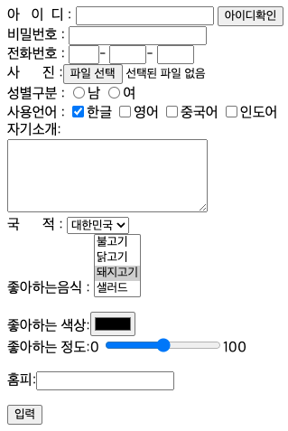

# HTML - II
목표 : form태그

## 입력 양식(form) 태그
 - > 입력 양식은 사용자에게 입력 받는 공간을 의미합니다. <br/>
 > 입력 양식을 만들 때 사용하는 태그입니다. <br/>
 > 입력 양식에 입력된 내용은 서버로 전송되어 구현된 웹 응용 프로그램이 구동되어 데이터베이스와 연동될 것입니다 
 ```html
    <form 속성1=속성값 속성2=속성값…>
        <input type=”~” name=”전달할파라미터이름”>
    …
    </form>
```
```html
<!DOCTYPE html>
<html lang="ko" xmlns="http://www.w3.org/1999/xhtml">
    <head>
        <meta charset="utf-8" />
        <title></title>
        <style> td{text-align:center;} </style>
    </head>
    <body>
        <form action="http://www.naver.com" method="get">
            <table>
                <tr><td>아이디</td><td><input type="text" name="id" /></td></tr>
                <tr><td>비 번</td><td><input type="password" name="pw" /></td></tr>
                <tr><td colspan="2"><input type="submit" /></td></tr>
            </table>           
        </form>
    </body>
</html>
```
- `action` : 입력 데이터의 전달 위치를 지정
- `method` : 입력 데이터의 전달 방식을 선택 
  - `get` : 데이터를 조회 할때
  - `post` : 데이터 전체를 새로 생성 및 수정할때.
  - `put` :  데이터의 일부를 수정 할때
  - `delete` : 데이터를 삭제할 때

- `input`태그 어트리뷰트
  - `type`: 어트리뷰트
    - `button` : 버튼
    - `checkbox` : 체크박스
    - `file` : 파일 입력
    - `hidden` : 보이지 않게 합니다.
    - `image` : 이미지 형태를 생성
    - `password` : 비밀번호 
    - `radio` : 라디오 버튼
    - `reset` : 초기화 버튼
    - `submit` : 제출 버튼
    - `text` : 글자 입력 양식을 생성
    - `password` : 비밀번호 입력 양식을 생성
    - `color` : 색상 선택 양식을 생성

- `select`태그 어트리뷰트
  - `multiple`: 다중선택 가능 옵션
  - 하위요소
    - `option`: 내부 옵션 설정


- 다음과 같은 화면 설계를 하시오

[코드](../../../../src/study/code/class01/chapter03/form_01.html)


## 게시판 예제
```html
<!DOCTYPE html>
<html lang="ko" xmlns="http://www.w3.org/1999/xhtml">
<head>
    <meta charset="utf-8" />
    <title></title>
    <style type="text/css">
        table {
            background-color: #FFFF55;
            border: pink solid 2px;
        }
    </style>
    <script type="text/javascript">
        function chk() {
            if (!frm.title.value) {
                alert("제목을 꼭 입력하세요");frm.title.focus(); return false;
            }
            if (!frm.name.value) {
                alert("작성자를 꼭 입력하세요"); frm.name.focus(); return false;
            }
            if (!frm.content.value) {
                alert("내용을 꼭 입력하세요"); frm.content.focus(); return false;
            }
            if (!frm.file.value) {
                alert("첨부파일를 꼭 입력하세요");frm.file.focus(); return false;
            }
            return true;
        }
    </script>
</head>
<body>
    <form action="http://www.choongang.co.kr" name="frm" onsubmit="return chk()">
        <table border="1">
            <caption><h2>게시판</h2></caption>
            <tr><td>제목</td><td><input type="text" name="title" size="30"></td></tr>
            <tr><td>작성자</td><td><input type="text" name="name" size="30"></td></tr>
            <tr>
                <td>내용</td>
                <td>
                    <textarea rows="8" cols="30" name="content"></textarea>
                </td>
            </tr>
            <tr><td>첨부파일</td><td><input type="file" name="file" size="30"></td></tr>
            <tr>
                <td colspan="2">
                    <center>
                        <input type="submit" value="입력완료">
                        <input type="reset" value="입력취소">
                    </center>
                </td>
            </tr>
        </table>
    </form>
</body>
</body>
</html>
```

```html
<!DOCTYPE html>
<html lang="ko" xmlns="http://www.w3.org/1999/xhtml">
<head>
    <meta charset="utf-8" />
    <title></title>
    <script>
        function chk() {
            if (!frm.uid.value) {
                alert("ID를 꼭 입력하세요"); frm.uid.focus(); return false;
            }
            if (frm.pw.value != frm.pwch.value) {
                alert("패스워드를 확인하세요");
                frm.pw.value = "";
                frm.pwch.value = "";
                frm.pw.focus();
                return false;
            }
            return true;
        }
    </script>
</head>
<body>
    <form action="#" name="frm" onsubmit="return chk()">
        I D : <input type="text" name="uid" /><br />
        P W : <input type="password" name="pw" /><br />
        pw체크:<input type="password" name="pwch" /><br />
        <input type="submit" value="전송" />
    </form>
</body>
</html>

<!DOCTYPE html>
<html lang="ko" xmlns="http://www.w3.org/1999/xhtml">
<head>
    <meta charset="utf-8" />
    <title></title>
    <script>
        function chk() {
            if (frm.pw.value != frm.pwch.value) {
                alert("패스워드를 확인하세요");
                frm.pw.value = "";
                frm.pwch.value = "";
                frm.pw.focus();
                return false;
            }
            return true;
        }
    </script>
</head>
<body>
    <form action="#" name="frm" onsubmit="return chk()">
        I D : <input type="text" name="uid" required="required"/><br />
        P W : <input type="password" name="pw" /><br />
        pw체크:<input type="password" name="pwch" /><br />
        <input type="submit" value="전송" />
    </form>
</body>
</html>
```

유효한 코드를 사용하지 않으면, 브라우저는 자체적인 방법으로 코드를 해석 하여 가끔은 개발자가 원하지 않은 결과를 보여주기도 합니다. <br/>
웹 페이지를 올바로 처리하기 위해서는 어떤 `DTD`(**D**ocument **T**ype **D**efinition, `문서 유형 정의`)를 사용해야 하는지 브라우저가 알 수 있어야만,<br/> 
`HTML` 문서 의 유효성 검사가 가능합니다.<br/>
유효성 검사를 하게 되면 개발하고 있는 웹 페이지에 원하는 모습으로 제대로 표현되는지, 아니면 어떤 문제가 있어 웹 문서가 제대로 표현이 안 되고 있는 지 알 수 있기 때문에, 유효성 검사는 아주 중요하다고 할 수 있습니다.
- `autofocus` : 포커스 자동 설정
- `placeholder` : 각 필드에 대한 입력 형식 힌트제공
- `required` : 필수 입력 필드
- `min`, `max` : 숫자의 범위를 설정
- `pattern` : 조건을 사용한 일반식 표시

```html
<!DOCTYPE html>
<html lang="ko" xmlns="http://www.w3.org/1999/xhtml">
<head>
    <meta charset="utf-8" />
    <title></title>
</head>
<body>
    전송안되는 것:<input type="text" name="test" id="test"/>
    <form>
        <p>전화 <input type="tel" placeholder="000-0000-0000"
                    name="tel" required="required" /></p>
        <p>카드 <input type="tel" pattern="[0-9]{4}-[0-9]{4}"
                  title="카드번호는 숫자4-숫자4개" name="card"
                     required="required" /></p>
        <p>업무 <input type="text" list="jobdata" name="job"/>
            <datalist id="jobdata">
                <option value="분석"></option>
                <option value="설계"></option>
                <option value="개발구현"></option>
                <option value="테스트"></option>
                <option value="유지보수"></option>
            </datalist>
        </p>
        <p>
            업무 <select name="job2">
                <option >분석</option>
                <option >설계</option>
                <option >개발구현</option>
                <option >테스트</option>
                <option >유지보수</option>
            </select>
        </p>
        <input type="submit" value="전송합니다" />
    </form>
    <a href="#test">맨위 입력</a>
</body>
</html>
```

- 사용자 인터페이스를 높이기 위한 `label`이용
```html
<body>
    <form>
        <fieldset>
            <legend>필드 유효성 검사</legend>
            <ul>
                <li>
                    <label for="name"><b>*</b>이름</label>
                    <input type="text" id="name" required="required" />
                </li>
                <li>
                    <label for="id"><strong>*</strong>아이디</label>
                    <input type="text" name="id" required="required" />
                </li>
                <li>
                    <label for="pw"><b>*</b>비밀번호</label>
                    <input type="password" id="pw" required="required" />
                </li>
                <li><label for="phone"><strong>*</strong>전화번호</label>
                <input type="tel" id="phone" required="required" /></li>
                <li><label for="email">이메일</label>
                <input type="email" id="email" /></li>
            </ul>
            <p><input type="submit" value="전송" /></p>
        </fieldset>
    </form>
</body>
```

- 사용자 인터페이스를 높이기 위한 `placeholder` 속성 : 각 필드에 대한 입력 형식 힌트
```html
<body>
    <form> 
        <fieldset>   
        <legend>필드에 입력형식 힌트주기 </legend>   
        <ul>         
        <li><label for="phone">핸드폰 번호</label>
            <input type="tel" id="phone" placeholder="01011112222" /></li>      
        <li><label for="email">이메일</label>
            <input type="email" id="email" placeholder="id@domain.com" /></li>   </ul>
        </fieldset>  
    </form>
</body>
</html>
```

- 사용자 인터페이스를 높이기 위한 `autofocus`
```html
<body>
    <form> 
    <fieldset>   
        <legend>포커스 자동이동</legend>   
        <ul>
            <li><label for="name"><b>*</b>이름</label><input type="text" id="name" autofocus="autofocus" /></li>
            <li><label for="id"><b>*</b>아이디</label><input type="text" id="id" /></li>
            <li><label for="pw"><b>*</b>비밀번호</label><input type="text" id="pw" /></li>
            <li><label for="phone"><b>*</b>전화번호</label><input type="tel" id="phone" /></li>
            <li><label for="email">이메일</label><input type="email" id="email" /></li>
        </ul>   
        <p><input type="submit" value="전송" /></p> </fieldset>  </form>
</body>
```

- 휴대폰번호 입력을 위한 패턴 유효성 체크
```html
<form > 
    <fieldset>
        <legend>pattern 속성</legend>
        <p><label for="tel">휴대폰 번호 : </label>
        <input type="tel" id="email" pattern="\d{3}-\d{3,4}-\d{4}" title="휴대폰 번호는 3자리 숫자-3자리에서 4자리 숫자-4 자리 숫자로 입력하셔야 합니다." /></p>
        <p><input type="submit" value="전송" /></p> 
    </fieldset> 
    </form>
```

```html
<!DOCTYPE html>
<html lang="ko" xmlns="http://www.w3.org/1999/xhtml">
<head>
    <meta charset="utf-8" />
    <title></title>
</head>
<body>
    <form>
        <fieldset>
            <legend>필드에 입력형식 힌트 주는 사용자 인터페이스</legend>
            <ul>
                <li><label for="phone">연락처 : </label>
                    <input type="tel" name="phone" autofocus="autofocus" 
                          id="phone" placeholder="010-0000-0000" /></li>
                <li><label for="email">이메일 : </label>
                    <input type="email" name="email"
                           id="email" placeholder="id@domain.com" /></li>
            </ul><p align="center">
                <input type="submit" value="입력완료" />
                <input type="reset" value="입력취소" />
                </p>
        </fieldset>
    </form>
</body>
</html>
- Readonly hidden disabled
<!DOCTYPE html>
<html lang="en" xmlns="http://www.w3.org/1999/xhtml">
<head>
    <meta charset="utf-8" />
    <title></title>
</head>
<body>
    <form>
        <input type="hidden" name="XXX" value="XXX" />
        시리얼번호입력<input type="text" name="no"/>
        <input type="button" value="이전" />
        <input type="button" value="다음" disabled="disabled"/><br /><br />
        선택한 책<input type="text" name="book" readonly="readonly" 
                    value="HTML5/CSS3" /><br /><br />
        수량 : <input type="number" min="1" max="10" name="su" /><br /><br />
        <input type="submit" value="전송합니다" />
    </form>
</body>
</html>
```
