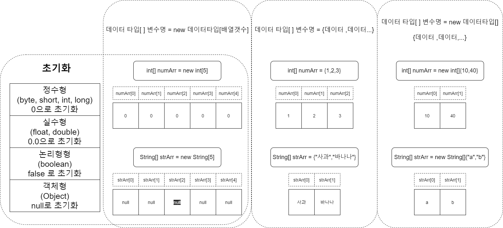

# 배열(array)
## 선언

배열은 대괄호`[]`로 배열을 선언한다. 그림과 같이 대괄호`[]`의 위치는 데이터 타입뒤에 써도 되고 변수뒤에 써도 무관하다.

각 배열은 인덱스로 구분되며 인덱스는 0부터 1씩 증가되는 숫자다.
```java
int[] numArr = new int[5];  //데이터 타입 뒤에 대괄호 []
int numArr2[] = new int[4]; //변수명 뒤에 대괄호 []

System.out.println(numArr[0]);  // numArr변수의 0번 인덱스값을 출력한다.
```
----
## 초기화
배열은 선언과 동시에 메모리에 영역을 할당받으며, 기본형타입은 데이터가 기본값으로 **초기화**되며, 객체형은 `null`값이 저장된다
> - 기본형 데이터 타입 : `byte`, `short`, `int`, `long`, `float`, `double`, `boolean`
> - 객체형 : `Object`, `String`... 등
- `null`
> `null`은 단순 문자열 null과는 다르다. 비어있다는 의미의 데이터다.
```java
//선언과 동시에 초기화 : 5칸짜리 int형 배열을 생성하며, 각 자리에 1,2,3,4,5를 저장한다.
int[] numArr = {1,2,3,4,5};

//3칸짜리 문자열 객체 배열을 생성 ( null 값이 저장됨 )
String[] strArr = new String[3];    
```

[[예제 코드]](../../code/class02/chapter04/Arr.java)

----
## 다차원배열
배열은 중첩해서 사용가능하다. 대괄호`[]`를 그저 중첩해서 사용하면된다.
```java
int[][] numArr = new int[3][3]; //2차월배열을 각 3칸씩 생성

System.out.println(numArr[2][1]);   //numArr배열변수의 2번인덱스의 1번인덱스값 출력
```
이와 같이 단순히 중첩해서 쓰기만하면된다. 그리고 그 수에 제한은 없다.
[[예제코드]](../../code/class02/chapter04/Arr02.java)