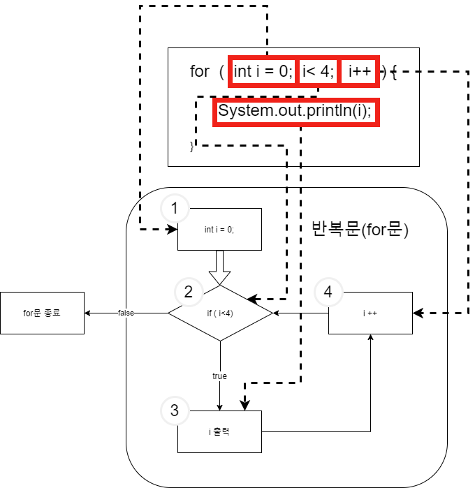

# 반복문
### 반복문
`for`
> ```java
> for(int i = 0; i < 10; i++){
>   System.out.println(i);
> }
> ```
> `i`가 0부터 1씩증가하며 10이 될때까지 반복하며 중괄호`{}`안의 내용을 반복하여 수행한다.<br>
> 여기서 선언한 `int i`는 `for`문 안에서만 존재한다.
> > `for`문 실행 전 `i`는 선언 되지 않는다.
<br>



[예제](../../code/class02/chapter03/Loop_For.java)

<br>

`while`
> ```JAVA
> int i = 0;
> while(i < 10){
>   System.out.println(i);
>   i++;
> }
> ```
> `i`가 10보다 작으면 중괄호`{}`안의 내용을 반복하여 수행한다.<br>
> 만약 `i`가 증가하지 않는다면 무한히 반복될 것이다.
> > `while`문 실행 전 `i`는 0
> > `while`문 실행 후 `i`는 10 
<br>
[[예제 코드]](../../code/class02/chapter03/Loop_While.java)

<br>

`do{...}whlie(true)`
> ```JAVA
> int i = 11;
> do{
>   System.out.println(i);
>   i++;
> }while(i < 10);
> ```
> 일단 조건없이 `do`뒤의 중괄호 `{}`안의 내용을 한번 실행한다.<br>
> 그 후 `while`조건이 `true`일때 반복한다.<br>
> [[예제 코드]](../../code/class02/chapter03/Loop_DoWhile.java)

`break`문
> 반복문을 빠져나올때 사용한다. 보통 일정조건을 확인하여 `if`문과 함께 사용한다.

`continue`문
> 반복문 실행 중 `continue`아래에 있는 명령은 실행되지 않고 다음 루프로 건너뛴다.
> [[예제 코드]](../../code/class02/chapter03/Loop_BreakContinue.java)

[[예제코드(숫자 입력받고 구구단출력)]](../../code/class02/chapter03/GuGuDan.java)