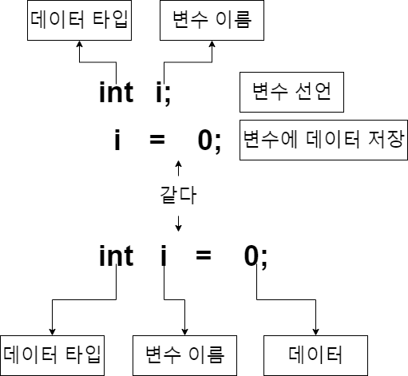
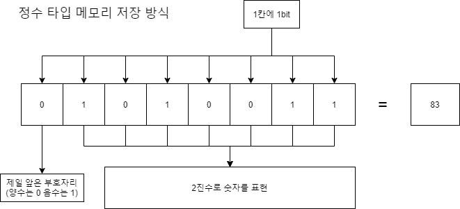

# **Chapter 02. 변수(Variable)**

## **변수와 상수**
- 변수 : 변하는 숫자
- 상수 : 변하지 않는 숫자(`final`)

[[예제 코드]](../../code/class02/chapter01/VarNConst.java)

----
## **변수 선언**


----
## **기본형 (primitive type)**
기본형 이란 변수가 선언 될때 메모리에 직접적으로 저장되는 데이터 타입이다.
자바에는 `기본형`과 `참조형` 타입이 있다.

----
### 정수형
정수형 숫자를 자바에서 표현하는 방식


`byte`
> 1byte(8bit)로 -128 ~ 127 까지 숫자를 저장할 수 있다.
> 

<br>

`short`
> 2byte(16bit)로 -32,768 ~ 32,767 까지 숫자를 저장할 수 있다. 

<br>

`int`
> 4byte(32bit)로 -2,147,483,648 ~ 2,147,483,647 까지 숫자를 저장할 수 있다.

<br>

`long`
> 8byte(64bit)로 -9,223,372,036,854,775,808 ~ 9,223,372,036,854,775,807 까지 숫자를 저장할 수 있다.

<br>

변수타입마다 가질 수 있는 숫자의 범위는 있지만 다루는 숫자의 범위가 작다고 `byte`나 `short`를 쓰지 않아도된다. 연산이 되는 경우 내부에서 `int`로 변경되어 계산되기 때문인데 이는 우리가 `byte`나 `short`에 연연하지 않아도 된다는 의미이다.

----
### 실수형
`float` 와 `double`
> 이 두 타입을 붙여놓은 이유는 간단하다. `double`는 `float`보다 더 크거나 작은수를 표현할 수 있다. 그뿐이다.

정리하면 우리가 자바에서 숫자를 다룰때 `정수형`인지 `실수형`인지만 잘 구분한다면 어려움이 없을것이다.

----
### 문자형
>인코드(encode)와 디코드(decode)
> > 컴퓨터는 문자를 표시하기위해 캐릭터셋(character set)이라는 표를 사용한다. 이는 각 숫자에 문자를 대응시켜놓은 표이고 메모리에 문자에 해당하는 숫자를 저장한다.
> > - 인코드(encode)
> > > 사람이 읽는 문자를 컴퓨터가 인식할 수 있는 캐릭터셋과 대응하는 값으로 변환하는 과정
> > - 디코드(decode)
> > > 인코드된 값을 사람이 읽을 수 있게 다시 문자로 변환하는 과정
>
> 캐릭터셋(charactor set)
> > - 아스키코드(ASCII)
> > > 아스키는 최초의 문자셋으로 1byte로 표시할수있는 문자셋이다.
> > > 총 128개(0~127)의 문자를 표시 할 수 있으며, 영어 및 기타 특수문자 등을 포함한다.
> > - EUC-KR(CP949)
> > > 한글을 표현할 수 있는 캐릭터 셋으로 완성형 캐릭터 셋이다. 완성형이란 한글과 같이 조합하여 사용하는 문자에서 조합 가능한 글자를 모두 생성하며 각 글자마다 코드를 부여한 캐릭터 셋이라는 뜻이다. 대표적으로 
> > - 유니코드(unicode)
> > > 유니코드란 전세계 모든 문자를 표현하기위해 고안된 문자표현 방식이다.<br> 자바는 이 유니코드를 사용하여 메모리에 저장하고 표현한다.
> > > 유니코드에도 여러가지 캐릭터 인코딩 방식이 있는데 자바에서는 `UTF-16`방식을 사용하여 문자를 다룬다. `UTF-16`은 기본적으로 2byte나 4byte로 표현된다.

`char`
> 단 1개의 문자만 저장가능한 기본형 데이터 타입이다.

[[예제 코드]](../../code/class02/chapter01/CharactorType.java)

<br>

`String`
> 문자열을 다루는 객체이다. 데이터 타입으로 생각하면 나중에 혼돈이 올수 있으니 그냥 이건 객체라고 알고 넘어가자
----
### 논리형
`boolean`
> `true`와 `false` 두가지 값만 가질수 있는 논리형 데이터 타입이다.


[예제 코드](../../code/class02/chapter01/Variable.java)

----
## 형변환(Type casting)
- 서로 다른 데이터타입을 하나의 데이터타입으로 통일
- 자동 형변환과 강제 형변환이 있음
- 바이트 크기가 작은 자료형에서 큰 자료형으로 형 변환은 자동으로 이루어 짐
- 덜 정밀한 자료형에서 더 정밀한 자료형으로읜 형 변환은 자동으로 이루어 짐

```java
byte bNum = 10;
int iNum = bNum;  

int iNum1 = 20;
float fNum = iNum2;

int iNum = 10;
byte bNum = (byte)iNum;

double dNum = 3.14;
int iNum2 = (int)dNum;
```
## 연산 중 형 변환 예제

```java
public class TypeCast {

	public static void main(String[] args) {

		double dou = 1.5;
		float flo = 0.6F;
		
		int i = (int)dou + (int)flo;
		int j = (int)(dou + flo);
		
		System.out.println(i);
		System.out.println(j);
	}
}
```