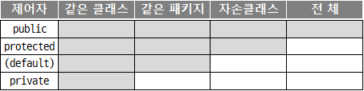
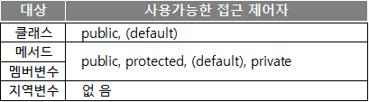

# 객체 지향_1
## 객체지향 개념(OOP/Object Oriented Programing)
 우주의 만물을 전부 객체라 칭해도 결코 과하지 않다. 그만큼 객체라 함은 굉장히 넓은 의미를 지닌다. 그것을 프로그램에 적용함으로 우리는 개발에 있어서 대상을 정의할때 인간이 정의 할수 있는 개념과 가깝게 그리고 이해하기 쉽게 프로그램할 수 있게 되었다.

 사물은 아무리 초라하더라도 나름대로 정의를 가지고 있다. 그리고 그 역할과 기능을 가지고 있다. 비록 먼지같이 공중에 떠다니는 아무의미 없는 존재 일 지라도 말이다. 우리는 필요에 의해 그 객체(대상)의 역할을 정의하고 구현할 수 있다. 이것이 객체 지향 프로그래밍의 기반이다. 

 자바에서는 객체를 클래스를 통해 정의하고, 사용한다. 그리고 상호작용하게 함으로 거대한 하나의 프로그램이 작동하게된다.

## 클래스의 구성
```JAVA
// 이 클래스가 속한 패키지의 위치
package pack.age.name;  

// java.util 패키지에 있는 Calendar클래스를 import
import java.util.Calendar;  

// java.util 패키지에 있는 모든 클래스를 import
// 패키지안에 있는 모든 클래스를 import하여 필요없는클래스까지 메모리에 로드한다.(메모리 낭비)
import java.util.*; 

//클래스 선언 : 클래스명은 파일명(JavaClass.java)과 같아야 한다.
public class JavaClass{

    {
        /* 초기화 블록
         *  - 생성자가 호출되면 생성자가 수행되기 전에 실행되는 블록 
         */
    }

    int i = 0;          //인스턴스 변수 or 전역변수
    static int j = 1;   //클래스 변수 or 스테틱변수

    public JavaClass(){ //생성자(constructor)
    }

    public int getMonth(){  //함수
        int month = Calendar.MONTH+1;   //로컬변수 or 지역변수
        return month;
    }
}
```

## 클래스와 객체
### 클래스
 > 클래스란 예를 들어 건물을 짓기 전에 설계를 하여 그 공법과 규격, 재료 등의 정보들을 미리 정의해 놓은 문서다.
 >
 > 클래스는 객체를 생성하기위해서 객체를 정의해 놓은 것
 ```java
    public class ClassObject{   //클래스 정의
        int a = 100;
        public int add(int i, int j ){
            return i+j;
        }
    }
 ```

### 객체
 > 객체는 클래스를 이용하여 실체를 생성한 상태를 의미한다.
```java
    public class Class01{
        public static void main(String[] args){
            Class02 c2 = new Class02(); //클래스 객체 생성(인스턴스 생성)
        }
    }
```
----

## 변수와 메서드
### 변수(variable)
1. 전역 변수(인스턴스 변수)
    > 클래스와 메서드 사이에 존재하는 변수다 
    > - 클래스로 객체가 생성되면 메모리가 할당되는 변수다.
    > - 객체가 생성되면 사용가능하다.
    ```java
    public class VarClass{
       int i = 100; //전역 변수
       
       public int add(int a, int b){   //메서드
            return a+b;
       }
       int j = 200; //전역 변수
    }
    ```
    
2. 지역 변수(로컬 변수)
    > 생성자, 초기화블록, 메서드 내부에 존재하는 변수
    > - `{...}`내부에 정의된 변수로 `{...}`내부에서만 사용가능하다.
    > - 생성자, 초기화블록, 메서드가 수행되는 동안에만 메모리에 존재한다.
    ```java
    public class VarClass{
        {
            int local = 100;    //지역변수
        }
        public void add(int a, int b){
            int result = a+b;      //지역변수
            return result;
        }
    }
    ```

3. 스테틱변수(클래스 변수)
    > `static` 제어자가 선언된 변수
    > - 프로세스(프로그램)이 구동되면 JVM이 메모리에 제일먼저 메모리가 할당된다.
    > - 객체(인스턴스)를 생성하지 않고 데이터를 사용가능하다
    ```java
    public class VarOne{
        public static void main(String[] args){
            System.out.println(VarTwo.i);
        }
    }
    class VarTwo{
        static int i = 100;
    }
    ```
----
## **제어자**
제어자는 크게 두가지로 나뉜다.
> **접근 제어자** : `public`, `protected`, `default`, `private`
>
> **그 외** : `static`, `final`, `abstract`, `native`, `transient`, `synchronized`, `volatile`, `strictfp`

- 제어자는 클래스나 멤버변수와 메서드에 주로 사용
- 하나의 대상에 대해서 여러 제어자를 조합하여 사용하는 것이 가능하다.
- **단, 접근 제어자는 한번에 하나만 사용 가능하다.**

### `static`
> static은 '클래스의' 또는 '공통적인'의 의미를 가지고 있다.
>
> 인스턴스변수는 하나의 클래스로 부터 생성되었더라도 각기 다른값을 유지하지만, 클래스변수(static멤버변수)는 인스턴스에 관계없이 같은 값을 갖는다.
> > **​`static`이 사용될 수 있는 곳 - 멤버변수, 메서드, 초기화 블럭**

<br>

### `final`
> 수학에서의 상수의 개념이다. π(PI)와 같은 절대 변하지 않는 숫자의 개념이다.
> > **`final`이 사용될 수 있는 곳 - 클래스, 메서드, 멤버변수, 지역변수**

### `abstract`
> abstract는 '미완성'의 의미를 가지고 있다.<br>
> 메서드의 선언부만 작성하고 실제 수행내용은 구현하지 않은 추상 메서드를 선언하는데 사용된다.
> > 상세 내용은 아래 [[추상클래스]](#**추상클레스**)에서 다룬다.

## **접근제어자**
> 멤버 또는 클래스에 사용되어, 해당하는 멤버 또는 클래스를 외부에서 접근하지 못하도록 제한하는 역할
> > - 접근 제어자가 `default`임을 알리기 위해 실제로 `default`를 붙이지 않는다.
> > - 아무런 접근제어자가 붙어있지 않다면 접근제어자가 `default`임을 뜻한다.
>
> ### `private`
> > 같은 클래스 내에서만 접근이 가능
>
> ### `default`
> > 같은 패키지 내에서만 접근이 가능
> 
> ### `public`
> > 접근 제한이 전혀 없다.
> 
> ### `protected`
> > 같은 패키지 내에서, 그리고 다른 패키지의 자손클래스에서 접근이 가능<br>
> 
> [[예제-대상객체]](../../code/class03/chapter01/Ex01.java)
> [[예제-메인객체]](../../code/class03/chapter01/Ex02.java)
> [[예제-디폴트테스트객체]](../../code/class03/chapter01/access/Ex03.java)
> 
> 
> 
> 접근 범위가 넓은 쪽에서 좁은 쪽의 순으로 왼쪽부터 나열
> > public > protected > (default) > private
> 
> 