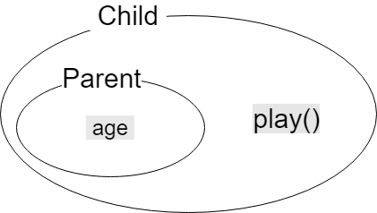

# 상속(inheritance)
## 상속의 정의와 장점

​	**상속** : 기존의 클래스를 재사용하여 새로운 클래스를 작성하는 것

​	**장점** 
- 코드의 양이 적어진다
   
- 코드의 추가 변경이 용이하다.
   
- 코드의 재사용성을 높인다.

- 코드의 중복을 제거하여 생산성과 유지보수에 용이하다.

​	**사용법** 

```java
class Child extends Parent{
	....
}
```

> ​	**조상클래스** : 부모(parent)클래스, 상위(super)클래스, 기반(base)클래스
>
> ​	**자손클래스** : 자식(child)클래스, 하위(sub)클래스, 파생된(derived)클래스


상속관계를 그림으로 나타내면 아래와 같다.


**상속받은 클래스의 변수**

```java
class Parent{
    int age;
}
class child extends Parent{
    ....
}
```



그림처럼 변수 `age`는 `Parent`클래스에 선언되어 있고 그 `Parent`클래스를 `Child`클래스가 상속받은 상태다. 그리고 `Child`클래스에는 `play()`함수가 작성되어있다.

`play()`함수는 `Child`클래스에 정의된 함수이므로 `Parent`클래스에는 아무런 영향이 없다.

이런식으로 상속관계를 확장시켜 나갈 수 있다. 어떤 클래스에서 `Child`클래스를 상속받는다면 `Parent`클래스의 구성요소와 `Child`클래스의 구성요소들을 사용할 수 있다.

<u>**변수 or 함수의 접근제어자가 `private`라면 상속받더라도 직접적인 접근은 불가능하다.**</u>

```
Child child = new Child();
System.out.println(child.age);
child.Play();
```

> - **생성자와 초기화 블럭은 상속되지 않는다. 멤버만 상속된다. **
> - **자손 클래스의 멤버 개수는 조상 클래스보다 항상 같거나 많다. **


클래스 `Child`와 `Child2`가 모두 `Parent`클래스를 상속 받고 있으므로  `Parent`클래스와 `Child`클래스, 그리고 `Parent`클래스와 `Child2`클래스는 서로 상속 관계에 있지만 클래스 `Child`와 `Child2`간에는 서로 아무런 관계도 성립되지 않는다. 클래스 간의 관계에서 형제 관계와 같은 것은 없다.

 이 경우 한 클래스에서 상속받아서 사용하는경우 코드의 중복이 최소화 된다.

```java
class Parent{}
class Child extends Parent{}
class Child2 extends Parent{}
class GrandChild extends Child{}
```

child클래스 또한 하나에 객체 이므로 다른 객체를 생성할 때 상속받을 수 있다. `GrandChild`객체는 `Parent`객체와 `Child`객체의 속성을 모두 갖고 있다. 


* `Parent` >`Child`>`GrandChild` 순서의 상속관계

```java
GrandChild grandChild = null;
Child child = new GrandChild();
grandChild = (GrandChild)child;
```


## 클래스간의 관계 포함관계

​	**포함관계** : 한 클래스의 멤버변수로 다른 클래스 타입의 참조변수를 선언하는 것


`Point`클래스에는 원점 `x`와 `y`가 들어있을 것이다. 이렇게 상속과는 다른 포함관계라고 한다.

> * Tip 
>
> 1. 단위별로 여러개의 클래스를 작성
>
> 2. 단위 클래스를 포함관계로 재사용
>
>    위 두단계로 클래스를 작성하면 재사용성을 늘릴 수 있다.


``` java
class Car {
    Engine e = new Engine();	// 엔진
    Door[] d = new Door[4];		//문, 문의 개수를 넷으로 가정하고 배열로 처리했다.
}
```

` Car`클래스의 단위 구성요소인 `Engine`, `Door`와 같은 클래스를 미리 작성해 놓고 이 들을 `Car`클래스의 멤버변수로 선언하여 포함관계를 맺어주면, 클래스를 작성하는 것도 쉽고 코드도 간결해서 이해하기 쉽다.


## 클래스간의 관계 결정하기


그림의 두경우를 비교해 보면 `Circle`클래스를 작성하는데 있어서 Point클래스를 포함시키거나 상속받도록 하는 것은 결과적으로 별 차이가 없어보인다.

그럴 때는 아래 문장을 대입해서 생각해 보자

``` 
	원(Circle)은 점(Point) 이다. - Circle is a Point.
	원(Circle)은 점(Point)을 가지고 있다. - Circle has a Point.
```

위와 같이 생각해보면 아주 편하다 .

**원은 따지고 보면 점은 아니지만**

**원은 점들로 이루어졌다고 보면 된다. 그러니 점의 속성을 갖고 있는 것이 된다.**

클래스 관계를 결정할 때 적절한 예로 보인다.

[[예제코드]](../../code/class03/chapter02/DrawShape.java)

```java
class Circle extends Shape{		//Circle과 Shape은 상속관계
    Point center;				//Circle과 Point는 포함관계    
}
```

* **객체배열**


예제코드 의 `Point`객체배열을 예로 그림을 다시 그렸다.

> 1. **객체배열은 참조변수 배열이다.**
>
> 2. **이 배열에 실제로 저장된 것은 객체가 아니다.**
>
> 3. **배열의 각 인덱스에 저장된 것은 객체의 주소이다.**
>
> > `Point`객체배열 변수 point라고 이름지어진 `0x100`주소에 생성
> >
> > 0번 인덱스는 `0x200`주소를 가르킨다.
> >
> >  `0x200`주소에는 객체의 데이터가 저장되어있다.


## 단일 상속(single inheritance)

Java는 다중상속이라는 개념이 없고, 상속은 단 1개의 클래스에서만 상속을 받을 수 있다.( 다른 객체지향 언어인 C++에서는 가능하다.)

```java
class TVCR extends TV, VCR {		//에러. 조상은 하나만 허용된다.
    //...
}
```

- 다중상속을 포기함으로 코드가 더욱 명확해 진다.
  - 메소드 및 변수의 출처가 명확하다. 자신아니면 부모뿐이기 때문


## Object클래스 모든 클래스의 조상

`Object`클래스는 모든 클래스 상속계층도의 최상위에 있는 조상클래스이다.

```java
class Tv{
    ...
}
```

위와 같이 아무 것도 상속 받지 않은 클래스를 작성했다면 자동으로 `Object`클래스를 상속받게 된다.

간접적으로 해당클래스에 아무런 메소드를 작성하지 않았더라도 `toString()`메소드나 `getClass()`같은 메소드를 쓸수 있다. 바로 `Object`클래스에 정의되어 있기 때문이다.
