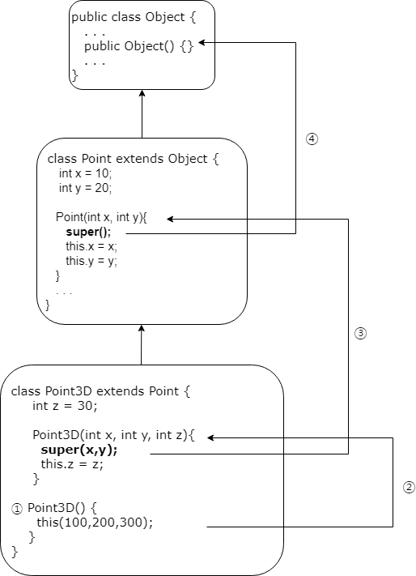

# 오버로딩 (Overloading)
## 정의
 - 오버로딩은 같은이름의 메소드를 매개변수(파라미터)의 구성으로 구분지어 여러개의 매소드로 정의 하는 것을 의미한다.

```java
public class Overloading{
    public void print(){
        System.out.println("print method");
    }

    public void print(String content){
        System.out.println(content);
    }

    public void print(String content, int round){
        for(int i = 0; i<round;i++){
            System.out.println(content);
        }
    }

    public void print(String content, int round, boolean boo){
        if(boo){
            for(int i = 0; i<round;i++){
                System.out.println(content);
            }
        }
    }
}
```
[[오버로딩 - 예제]](../../code//class03/chapter03/Overloading.java)

### 주의 
  1. 갯수와 데이터 타입의 자리가 중복되지 않아야 한다.
      - 갯수가 같아도 파라미터의 데이터타입 자리가 다르다면 사용가능하다.
  2. 리턴타입이 달라도 파라미터의 갯수와 파라미더 데이터 타입의 자리가 같으면 컴파일 오류가 발생한다.
      - `void print(String content, int round){...}` 이런 메소드가 정의되어 있다면 
      - `String print(String content, int round){...}` 리턴타입이 다르다고해도 사용할 수 없다.


# 오버라이딩(Overriding)
## 정의
 - 오버라이딩은 자손클래스에서 이미 부모클래스에 정의되어있는 메소드를 재정의하는 것을 의미한다.

```java
public class Child extends Parent{
    @Override
    public void print(){
        System.out.println("자식이다");
    }
}

class Parent{
    public void print(){
        System.out.println("부모다");
    }
}
```
### 특징
  1. 이미 부모클래스에 정의되어 있는 메소드여야 한다.
  2. 파라미터의 갯수와 데이터타입의 자리가 같아야 한다.
  3. `super.메소드이름`으로 오버라이딩 되기전에 메소드를 호출 할 수 있다.
  4. 접근 제어자는 부모클래스의 메서드보다 좁은 범위로 변경 할 수 없다.
      - 접근제한자의 범위 : `public` > `protected` > `default` > `private`
  5. 조상클래스의 메서드보다 많은 수의 예외를 선언 할 수 없다.
      - 만약 조상클래스의 메서드가 `IOException`같은 특정메소드를 `throw`한다면, 추가로 다른 `Exception`을 `throw`하거나 예외처리 최상위 클래스인 `Exception`클래스를 `throw`한다면 컴파일 오류가 발생한다.

# super
## 정의
 - 자손클래스에서 조상 클래스로부터 상속받은 멤버를 참조하는데 사용되는 참조변수

```java
  class SuperTest{
      public static void main(String[] args){
          Child c = new Child();
          c.method();
      }
  }
  
  class Parent{
      int x = 10;
  }
  
  class Child extends Parent{
      int x = 20;
      void method(){
          System.out.println("x="+x);
          System.out.println("this.x="+this.x);
          System.out.println("super.x="+super.x);
      }
  }
  ```

  * **결과** : x=20

    ​		   this.x=20

    ​	       super.x=10

  `Child`클래스에 정의된 `x`는 20이고 `this.x`는 결국 자신을 가리키므로 20이 된다. 

  하지만 조상클래스를 가르키는 `super.x`는 10을 출력한다.

  * 참고로 지금상황은 오버라이딩이 아니다. 변수가 각자 정의된 것이다. 정의하지 않고 바로 `x`에 값을 대입했다면 상속받은 변수의 값이 변경됐을 것이다.

  ```java
  class Point{
      int x;
      int y;
      
      String getLocation(){
          return "x:"+x+", y:"+y;
      }
  }
  
  class Point3D extends Point{
      int z;
      String getLocation(){		//오버라이딩
      	//return "x:"+x+", y:"+y+", z:"+z;
          return super.getLocation()+", z:"+z;	//조상메서드 호출
      }
  }
  ```

  오버라이딩을 한다해도 조상클래스에 정의된 내용이 변경되는 것이 아니므로 위와같은 응용이 가능하다.

  ## super() - 조상클래스의 생성자
  ```java
    class Point{
        int x=10;
        int y=20;
        Point(int x, int y){
            //이 위치에 최상위 클래스인 Object클래스의 생성자 super();가 자동으로 들어간다.
            this.x=x;
            this.y=y;
        }
    }

    class Point3D extends Point{
        int z = 30;
        Point3D(int x, int y, int z){
            super(x,y);//이렇게 정의하지 않으면
                       //Point()가 정의되어있지 않았으므로 오류가 발생한다.
            this.z=z;
        }
    }
```

