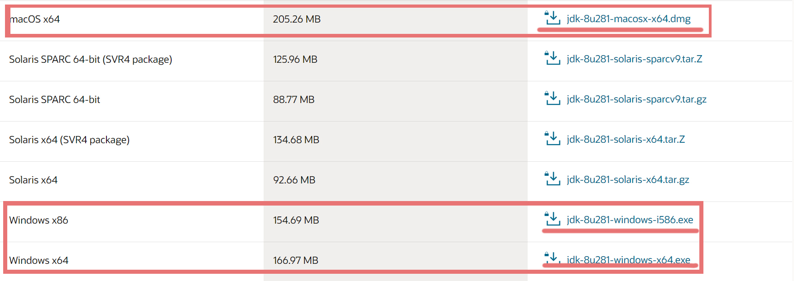
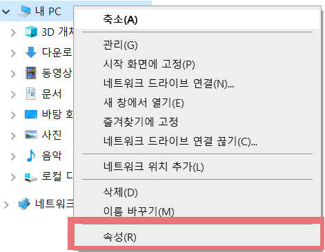
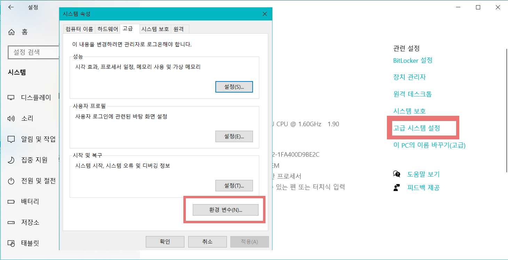
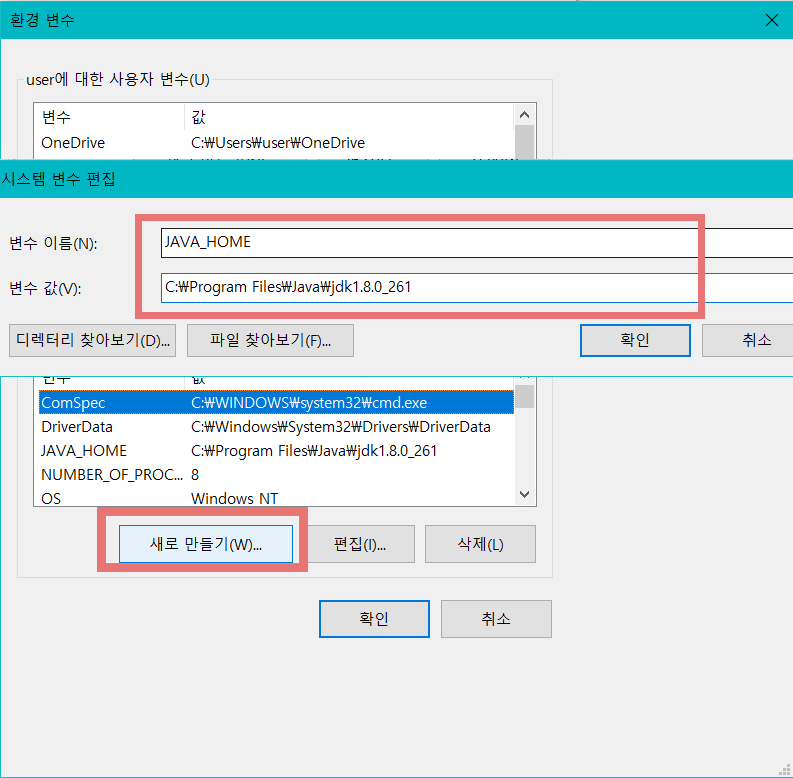
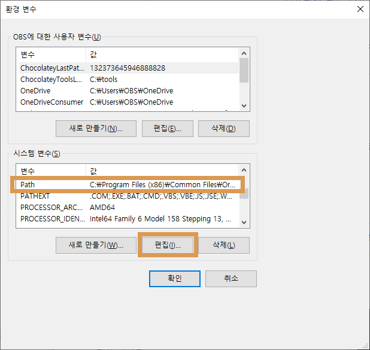
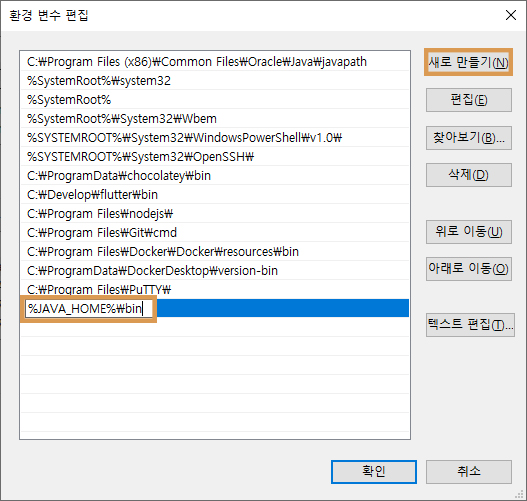
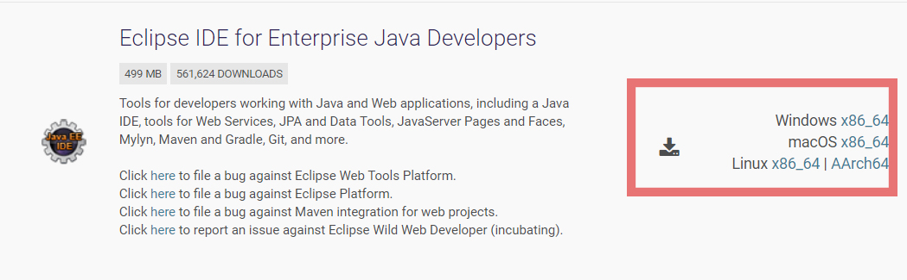
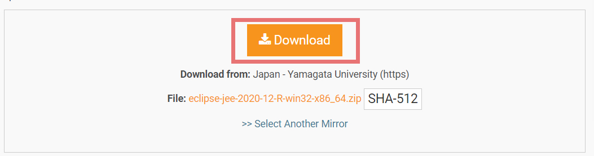
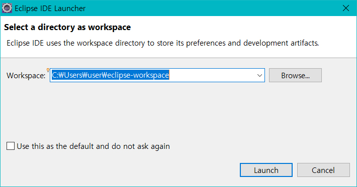
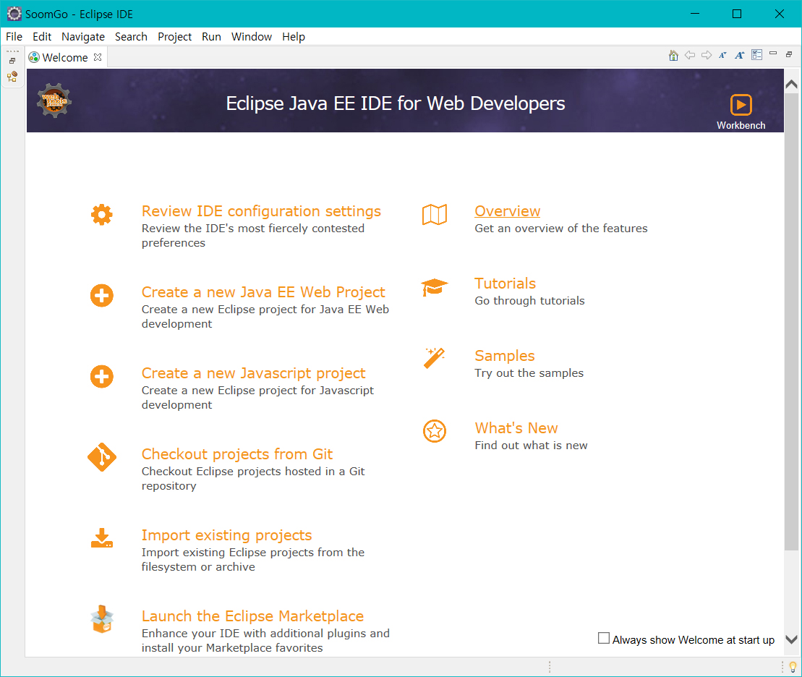

# Class01

## 개발환경 구축

### 목차

| No   | List                                                         |
| ---- | ------------------------------------------------------------ |
| 1  | [자바설치](#1-자바-설치)                |
| 2  | [환경변수 설정](#2-환경변수-설정)  |
| 3  | [Eclipce](#3-Eclipce-설치)  |
| 4  | [Hello World 출력](#4-Hello-World출력)  |

### 1 자바 설치

- [Java SE Development Kit 8 - Downloads | Oracle 대한민국](https://www.oracle.com/kr/java/technologies/javase/javase-jdk8-downloads.html)
  - Oracle JDK8 (OS 확인 후 설치)
    - 

### 2 환경변수 설정

- MacOS
  - 터미널 > `]# vi .bash_profile`
  - `i`  > `export JAVA_HOME=/Library/Java/JavaVirtualMachines/jdk1.8.0_241.jdk/Contents/Home` > `ESC` > `:wq` > `ENTER`
- Windows
  
  - **`내컴퓨터 `** > **`속성 `**> **`고급설정`**
  
    
  
  - **`고급 시스템 설정`** > **`환경 변수`**
  
    - 
  
  - **`시스템 변수`** > **`새로 만들기`** > **`변수 이름 / 변수 값`**
    - 변수 이름 : **`JAVA_HOME`**
    - 변수 값 : `C:\Program Files\java\jdk[version]`
    - 
  
  - **`Path` 에 경로 추가**
    - `시스템 변수` > `Path` > `편집`클릭
    - `새로 만들기` > `%JAVA_HOME%\bin` 입력 > 확인
    - 
    - 

### 3 Eclipce 설치

이클립스는 통합 개발 툴이다. 통합이라고 하는 이유는 많은 기능을 가지고 있는 강력한 툴이기 때문이다. 코딩, 컴파일, 테스트, 배포, 패키징, 프로젝트 관리 등등 많은 기능을 지원한다. 또한 자바뿐만 아니다 다른 많은 언어들도 지원하기 때문에 많은 개발자들이 추천하는 개발 툴이다.

- 다운로드

  - 이클립스는 설치버전과 비 설치 버전이 있다. 우리는 비설치 버전을 다운받아서 사용한다.

  - [다운로드]: https://www.eclipse.org/downloads/packages/

  - 
  
  - 
  
  - 자신이 쓰는 OS에 맞게 다운로드한 후 압축을 푼다.
  
    - 
    더블클릭 하여 실행한다.
  
  - 로딩화면이 뜨면 잠시 기다린다.
  
    - 
  
    
  
  - 아래 창이 뜨면 이클립스가 관리할 프로젝트 디렉토리를 설정한다.
  
    - 우리는 앞으로 지금 설정한 프로젝트 경로에서 모든 실습과 코드를 관리할 것이다. 그러므로 관리할 경로를 잘 기억할 수있는 장소로 선택하여 `Launch`를 누르면 이클립스가 실행된다.
    - 
  
  - 첫화면
  
    - 
    - 위 이미지와 같이 뜨면 성공이다.
