# `Terminal`환경에서 자바 실행
## 컴파일(`class`파일 생성과 실행)'
1. 코드 작성
  - 1. `C:`드라이브에 `java`폴더 생성
  - 2. 메모장 실행
   ```java
   public class Test{
       public static void main(String[] args){
           System.out.println("Hello world");
       }
   }
   ```
   - 3. 입력후 저장 > 파일명 `Test.java`
  
 2. `Window` + `r` 
 3. `cmd` 엔터 : command창 실행 ( MS-DOS )
   - 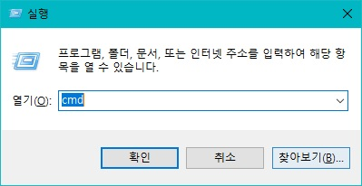
 4. `cd C:/java` 엔터
 5. `javac Test.java` 엔터 = `컴파일`
 6. `C:/java`폴더에 `Test.class`파일 생성확인
 7. `java Test` 엔터 = `JVM 에게 Test.class파일 실행 요청`
 8. `Hello world` 출력
    - 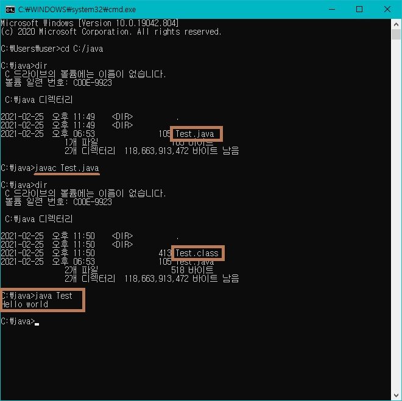


# `eclipce`에서 자바 실행

## 프로젝트 생성

  - 프로젝트는 우리가 만들 하나의 프로그램 단위라고 보면된다. 우리는 이 프로젝트를 통해 공부하는 과정을 관리하게 될것이다. 
  - 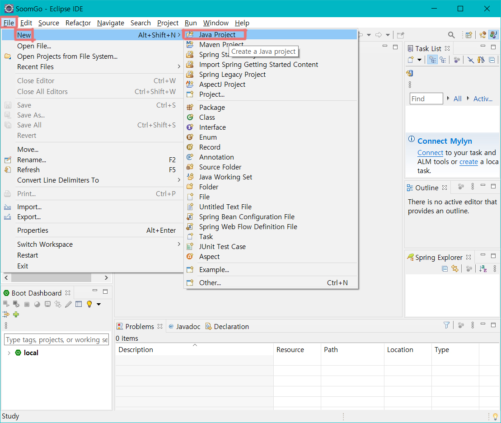
  - 이클립스 메뉴 바 >`File`>`New`>`Java Project` 클릭
  - 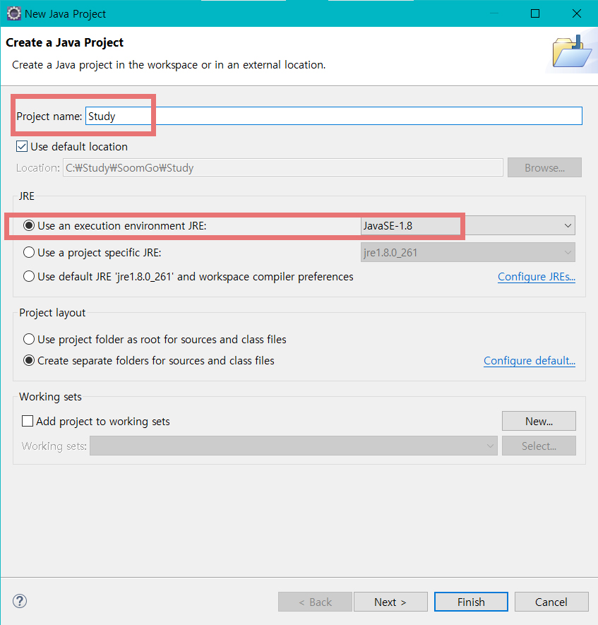
    - `Project name` : 이곳에는 프로젝트 이름을 입력한다. 
    - `JRE` > `Use an excution environment JRE` 체크
    - 우리가 이번 공부에서 사용할 자바 버전은 8버전이니 `JavaSE-1.8`을 선택한다.
    - 하단에 `Finish`버튼을 눌러 프로젝트를 생성한다.
  - 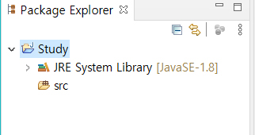
  - `Package Explorer`에 프로젝트가 생성됐다.
  - `JRE System Library` : 프로젝트는 기본적인 자바를 다루기 위한 지초 프로젝트로서 자바가 가지고 있는 기본기능들만 포함한다. 그 기능들은 `JRE System Library`라는 위치에 집합되어 있고, 이를 언제든지 제한없이 사용할 수 있다.
  - `src` : 이곳이 우리가 코딩할 위치이다. 여기에 소스코드를 작성한다.

### Hello World출력

- 패키지 생성

  - 패키지랑 프로젝트 안에서 폴더구조라고 보면된다. 폴더구조와 완전 동일하니 크게 복잡하게 생각할 필요가 없다. 자바 심화 과정에서 다시 배울 것이니 폴더라고 이해하고 넘어가면 된다.

  - 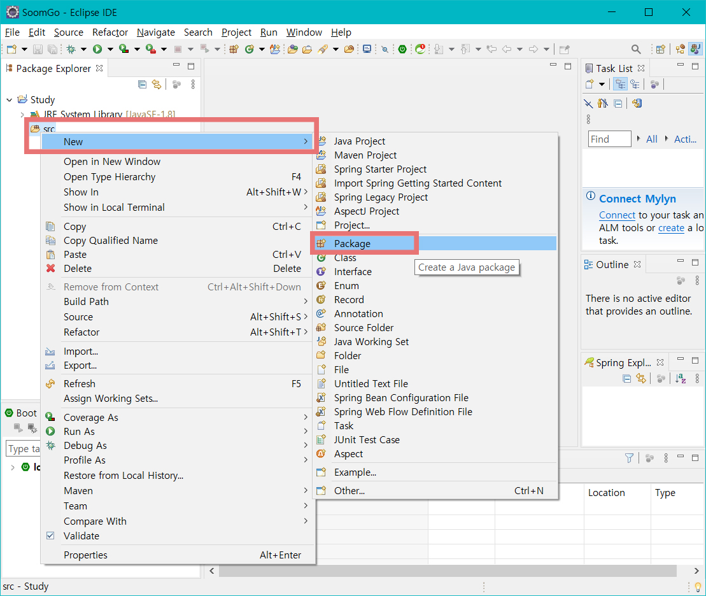

    - `src` >`마우스 우클릭` > `New` > `Package` 클릭

    

  - 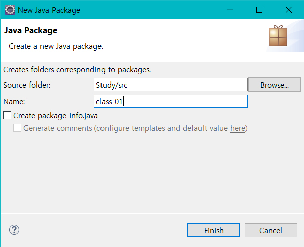

    - `Name` : class_01 입력 > `Finish`클릭

  - 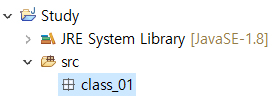

    - 패키지가 생성됐다.

  - 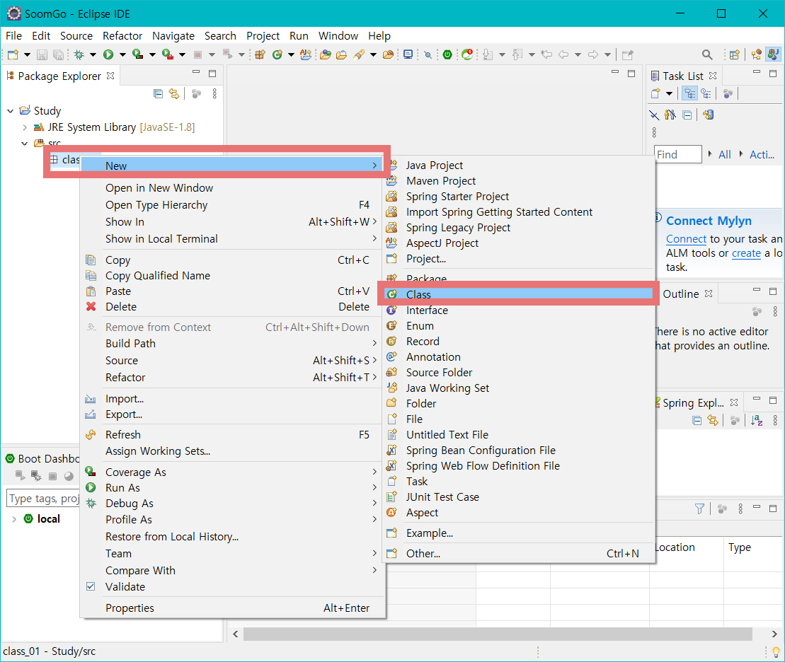

    - `class_01` 우클릭>`New`>`Class` 클릭

  - 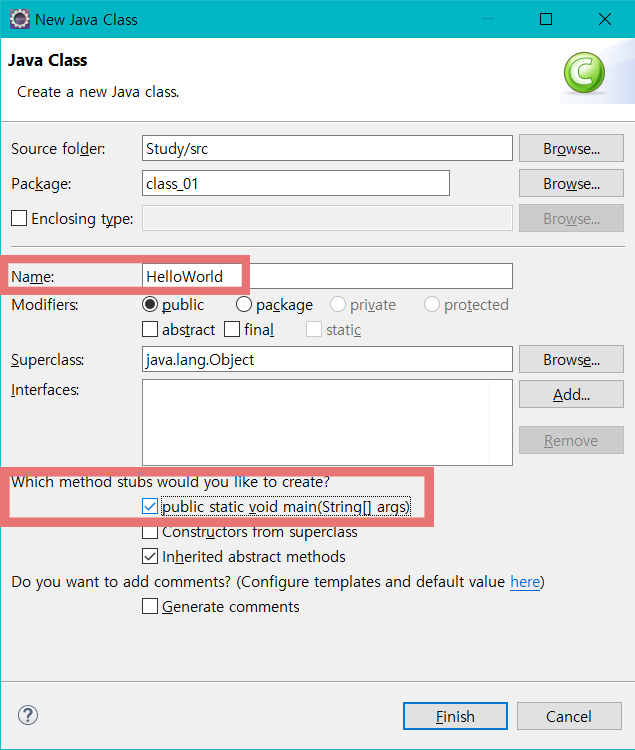

    - `Name` : HelloWorld
    - `Which method stubs would you like to create?` > `public static void main(String[] args)` 체크 > `Finish` 클릭

    

  - 

    - 좌측 `Package Explorer`에 방금 생성한 이름의 `HelloWorld.java`가 생성된것이 보인다. 그리고 우측에 그 파일이 자동으로 열려있다.

  

  - ```java
    public static void main(String[] args){
        //TODO Auto-generated method stub
        System. out.println("Hello world");
    }
    ```

    - 모든 코딩은 중괄호(`{ }`) 안에 들어가야 한다. 그러므로 `public static void main(String[] args){}`의 중괄호 안에 `System.out.println("Hello World");` 를 입력하고 저장한다.
      - 세미콜론 `;`을 잊지 말아야 한다. 자바에서 모든 명령어 마지막에는 세미콜론이 있어야 한다. 

  - 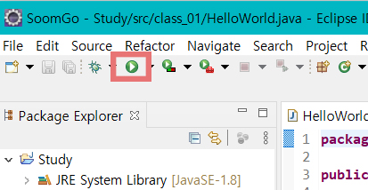

    - 실행 : 이클립스 상단 버튼 모음에 `run`버튼 클릭 or `Ctrl`+`F11` 을 누르면 실행된다.

  - 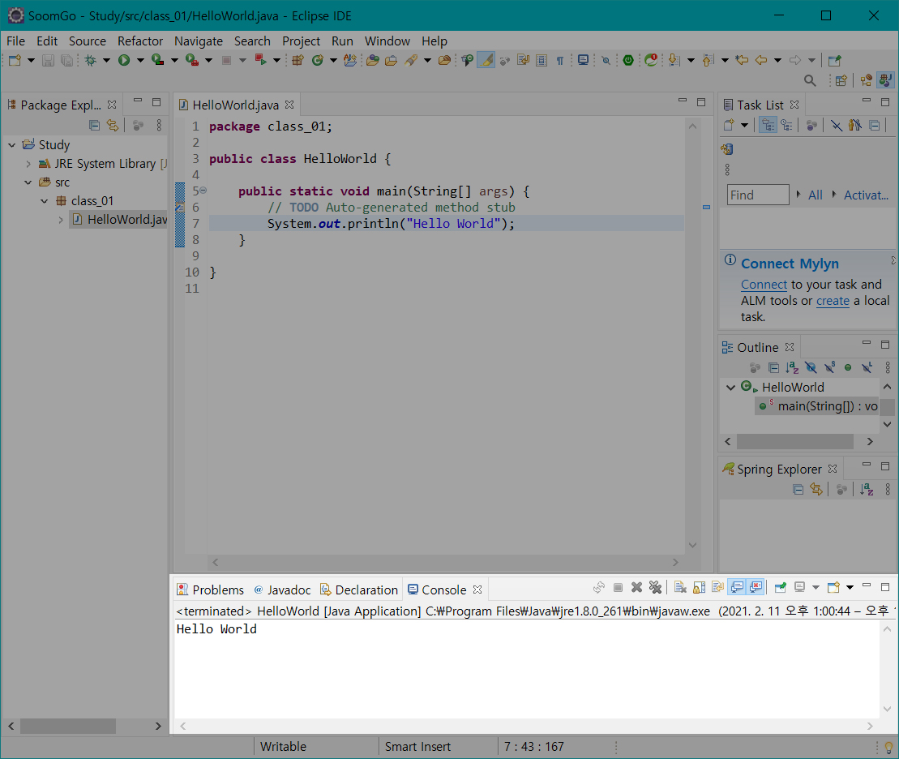

    - 위 이미지와 같이 이클립스 아래쪽 창을 보면 우리가 `System.out.println("Hello World");` 라고 입력한 내용이 출력된다.

## `class` 작성 규칙
> - 위에서 작성한 `Test.java`파일은 자바에서 `.class`파일로 컴파일된다.
> - 클래스파일은 내부에 `public class`로 시작한다.
> - 클래스를 작성할때는 몇가지 규칙이 있다.
> 1. 파일 내부에 `public class`가 존재하면 소스파일의 이름은 반드시 `public class`의 이름과 일치해야한다.
> 2. 파일 내부에 `public class`없는 경우, 소스파일의 이름은 내부에 클래스들 중 하나의 이름을 따르면된다.
> 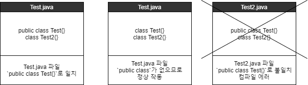
> [[예제 01]](../../code/class03/chapter02/TestClass.java) &nbsp; &nbsp; &nbsp; &nbsp; &nbsp; &nbsp; &nbsp; &nbsp; &nbsp; &nbsp; &nbsp; &nbsp; &nbsp; &nbsp; &nbsp; &nbsp;
> [[예제 02]](../../code/class03/chapter02/TestClassCase01.java) &nbsp; &nbsp; &nbsp; &nbsp; &nbsp; &nbsp; &nbsp; &nbsp; &nbsp; &nbsp; &nbsp; &nbsp; &nbsp; &nbsp;
> [[예제 03]](../../code/class03/chapter02/TestClassError.java)


## JVM(Java Virtual Machine)
> 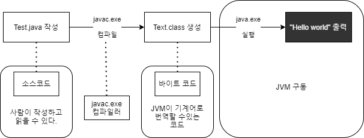
> 1. 코딩 > 컴파일 > 바이트코드 > JVM 구동