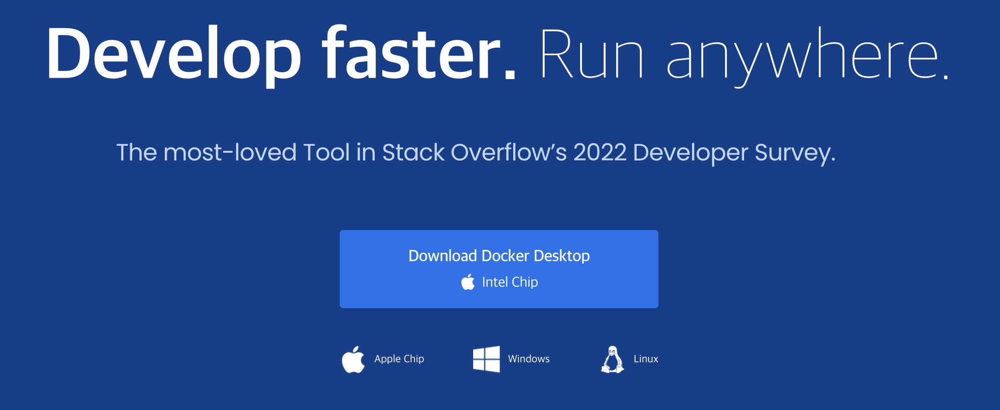

# Class04

## 개발환경 구축
 - `class04` 부터는 `Linux`기반의 `Terminal` 환경과 `Mac` 환경 위주로 교제가 작성됩니다.
 - 주제가 도커가 아니므로 도커에대한 설명은 최대한 생략합니다.

### 목차

| No | List |
| - | - |
| 1  | [도커 설치](#1-도커-설치)                |
| 2  | [도커 실행](#2-도커-실행)  |
| 3  | [데이터베이스 설치](#3-데이터베이스-설치)  |
| 4  | [데이터베이스 접속](#4-데이터베이스-접속)  |

### 1 도커 설치
 - 도커는 일종의 `가상머신`으로 개인 컴퓨터에 가상환경을 구축할수있게 도와주는 도구로서 도커를 사용하면 다른 프로그램에 영향을 주지 않은 상태로 자유롭게 개발환경을 구축할 수 있다.
> [[Docker WebPage]](https://www.docker.com/)
>  - OS 확인 후 설치



### 2 도커 실행
- 어플 실행
> 

### 3 데이터베이스 설치
1. 도커 이미지 다운로드
  > 터미널
    > > ``` terminal
    > > $ docker pull mysql
    > >```

2. 이미지 확인
  > 터미널
  > > ``` terminal
  > > $ docker images
  > > ```
  > 

3. 도커 컨테이너생성및 DB 설치
  > 터미널
   > > ``` termanal
   > > $ docker run -d -p 3306:3306 -e MYSQL_ROOT_PASSWORD=[비밀번호] --name mysql mysql

### 4 데이터베이스 접속
1. 도커 컨테이너 DB 접속
  > 터미널
    > > ``` terminal
    > > $ docker exec -it mysql /bin/bash
  > 

2. MySql 접속
  > 터미널
    > > ``` terminal
    > > bash-4.4# mysql -uroot -p[비밀번호]
  > 
